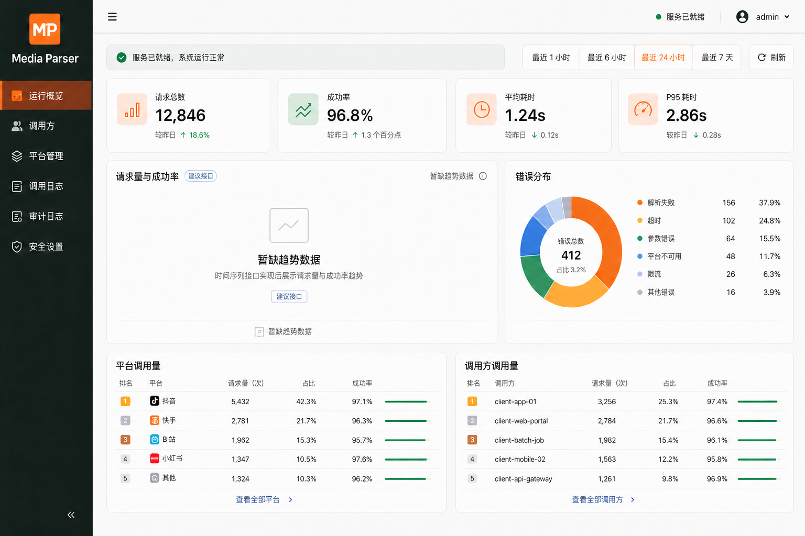

<p align="center">
  
</p>

<h1 align="center">Media Parser TS</h1>

<p align="center">
  基于 Node.js 24、TypeScript 与 Fastify 的多平台媒体原生解析服务
</p>

<p align="center">
  <a href="#核心能力">核心能力</a> ·
  <a href="#支持平台">支持平台</a> ·
  <a href="#docker-部署推荐">部署指南</a> ·
  <a href="#api-调用">API 调用</a> ·
  <a href="#本地开发">本地开发</a> ·
  <a href="api/openapi/openapi.yaml">OpenAPI</a>
</p>

`media-parser-ts` 参考 [ucmao/media-parser](https://github.com/ucmao/media-parser) 重构，面向自托管的网页、程序与内部服务提供统一媒体解析能力。服务会从分享文本中识别链接和平台，再由本地 TypeScript Parser 直接访问平台上游，提取视频、图集、音频、字幕或实况资源；默认不依赖第三方代解析 API。

除兼容原项目的解析响应外，本项目还提供调用方与 API Key 管理、平台凭据加密、SQLite 调用日志、运行统计、匿名解析网页和响应式管理后台。

> 本仓库当前注册 31 个 Parser。上游项目仍在持续增加平台，两边的数量和能力不会自动同步；请以本仓库的[平台定义](api/src/config/platforms.ts)和运行时 `GET /api/platforms` 为准。

## 核心能力

- **原生解析**：默认使用 TypeScript Parser，本地完成平台识别、跳转解析、请求签名和结果提取。
- **统一结果**：规范化输出标题、作者、封面、视频、图集、音频、字幕和 Live 实况资源。
- **两种接入方式**：提供需要 Bearer API Key 的 REST API，以及无需访客输入 Key 的同源匿名网页 BFF。
- **完整管理面**：管理调用方、API Key、平台启停、加密凭据、受控实网测试、调用日志、审计与统计。
- **安全请求链**：限制协议、端口、重定向、DNS、私网地址、响应体积和超时；请求 Cookie Jar 相互隔离。
- **可运营性**：API Key 限频与并发控制、结构化脱敏日志、健康/就绪检查、SQLite WAL、优雅退出。
- **容器化部署**：API、公开页和管理后台分为三个非 root 容器，只由入口 Nginx 发布一个端口。

## 界面预览

### 公开解析页


### 管理后台



## 支持平台

下表表示 Parser 声明支持提取的媒体类型，不代表每条分享都一定包含对应字段。实际结果会受到内容类型、登录态、地区、时效和平台接口变化影响。

| 平台 | 视频 | 图集 | 音频 | 字幕 | 实况 | 可选凭据 |
| --- | :---: | :---: | :---: | :---: | :---: | --- |
| AcFun | ✓ | — | — | — | — | — |
| Soul | ✓ | ✓ | — | — | — | — |
| 全民K歌 | ✓ | — | — | — | — | — |
| 剪映 | ✓ | ✓ | ✓ | — | — | — |
| 即梦AI | ✓ | — | — | — | — | — |
| 小云雀AI | ✓ | ✓ | — | — | — | — |
| 可灵AI | ✓ | — | — | — | — | — |
| 哔哩哔哩 | ✓ | — | ✓ | — | — | — |
| 好看视频 | ✓ | — | — | — | — | — |
| 小红书 | ✓ | ✓ | — | — | ✓ | `XIAOHONGSHU_COOKIE` |
| 视频号 | ✓ | — | — | — | — | `YUANBAO_COOKIE` |
| 微博 | ✓ | ✓ | — | — | — | — |
| 微视 | ✓ | — | — | — | — | — |
| 快手 | ✓ | ✓ | ✓ | — | — | `KUAISHOU_COOKIE` |
| 抖音 | ✓ | ✓ | ✓ | — | ✓ | — |
| 新片场 | ✓ | — | — | — | — | — |
| 最右 | ✓ | ✓ | — | — | — | — |
| 梨视频 | ✓ | — | — | — | — | — |
| 汽水音乐 | ✓ | — | ✓ | ✓ | — | — |
| 皮皮搞笑 | ✓ | — | — | — | — | — |
| 皮皮虾 | ✓ | ✓ | — | — | — | — |
| 知乎 | ✓ | ✓ | — | — | — | — |
| 绿洲 | ✓ | ✓ | — | — | — | — |
| 美拍 | ✓ | — | — | — | — | — |
| 腾讯频道 | ✓ | — | — | — | — | — |
| 虎牙 | ✓ | — | — | — | — | — |
| 西瓜视频 | ✓ | — | — | — | — | — |
| 豆包 | ✓ | ✓ | — | — | — | `DOUBAO_COOKIE` |
| 通义千问 | ✓ | ✓ | — | — | — | — |
| 夸克AI | ✓ | ✓ | — | — | — | — |
| 闲鱼 | — | ✓ | — | — | — | — |

标题、作者和封面会在平台上游能够提供时一并返回。需要登录态的内容可通过管理后台写入凭据；凭据使用 AES-256-GCM 加密保存，查询接口只返回掩码。环境变量也可用于受控部署，数据库中的托管凭据优先级更高。

## Docker 部署（推荐）

### 1. 准备配置

```bash
git clone https://github.com/x-dr/media-parser-ts.git
cd media-parser-ts
cp .env.example .env
umask 077
mkdir -p .local
touch .local/admin-password
chmod 700 .local
chmod 600 .env .local/admin-password
```

编辑 `.local/admin-password`，写入一行 12–128 个字符的强初始密码；再编辑 `.env`，至少配置：

```dotenv
ADMIN_BOOTSTRAP_USERNAME=admin
APP_ENCRYPTION_KEY=<Base64 编码的 32 字节随机密钥>
PUBLIC_WEB_API_KEY=
```

`APP_ENCRYPTION_KEY` 用于加密平台凭据，必须由可信的密码管理器或系统密钥工具生成并长期安全保存。不要提交 `.env`、密码文件、Cookie、API Key 或 SQLite 数据库。

### 2. 构建并启动

```bash
docker compose up --detach --build
docker compose ps
```

默认入口为 `http://127.0.0.1:8051`：

- 公开解析页：`http://127.0.0.1:8051/`
- 管理后台：`http://127.0.0.1:8051/admin/`
- OpenAPI 文件：[api/openapi/openapi.yaml](api/openapi/openapi.yaml)

验证容器和 API：

```bash
curl --fail http://127.0.0.1:8051/healthz
curl --fail http://127.0.0.1:8051/api/health
curl --fail http://127.0.0.1:8051/api/ready
```

`/api/health` 只表示进程存活；`/api/ready` 还会检查数据库、迁移、加密密钥和全部 Parser 注册。

### 3. 初始化公开解析页

首次登录管理后台时，使用 `.env` 中的管理员用户名和 `.local/admin-password` 中的初始密码。系统会要求立即修改初始密码。

随后在后台完成以下操作：

1. 创建用途为 `public-web` 的调用方。
2. 为它创建 API Key，并立即安全保存只展示一次的完整 `mp_...` Key。
3. 将这个 Key 写入 `.env` 的 `PUBLIC_WEB_API_KEY`。
4. 重新创建 API 容器并检查匿名网页状态。

```bash
docker compose up --detach --force-recreate
curl --fail http://127.0.0.1:8051/web-api/status
```

公开网页的 Key 只存在服务端，不能放入 `VITE_*`、HTML、前端 JavaScript 或浏览器存储。外部程序调用 `/api/parse` 时应创建另一个调用方和独立 Key，避免与公开网页共享配额和吊销范围。

### 容器拓扑

| 外部路径 | 内部目标 |
| --- | --- |
| `/`、`/assets/` | Web Nginx 静态资源与 SPA 回退 |
| `/admin/` | Admin Nginx |
| `/api/`、`/web-api/` | Fastify API |
| `/healthz` | 入口 Nginx 健康检查 |

Compose 只发布 `${MEDIA_PARSER_PORT:-8051}`，API 与 Admin 不直接暴露宿主端口。SQLite 数据保存在 `media-parser-data` 命名卷，管理员初始密码以只读 Compose secret 挂载。

## API 调用

### 健康检查

```http
GET /api/health
```

```json
{
  "status": "ok"
}
```

### 媒体解析

```http
POST /api/parse
Authorization: Bearer mp_<key-id>_<secret>
Content-Type: application/json
```

请求体：

```json
{
  "text": "这里可以粘贴完整分享文案或 https://v.douyin.com/..."
}
```

`text` 必填，长度为 1–2000 个字符。调用示例：

```bash
curl --fail-with-body http://127.0.0.1:8051/api/parse \
  --request POST \
  --header 'Content-Type: application/json' \
  --header "Authorization: Bearer ${MEDIA_PARSER_API_KEY}" \
  --data '{"text":"这里替换为分享文本或链接"}'
```

成功响应沿用原项目的数据外壳：

```json
{
  "retcode": 200,
  "retdesc": "成功",
  "data": {
    "video_id": "7123...",
    "platform": "抖音",
    "title": "作品标题",
    "video_url": "https://...",
    "audio_url": "https://...",
    "cover_url": "https://...",
    "author": {
      "nickname": "作者昵称",
      "author_id": "作者 ID",
      "avatar": "https://..."
    },
    "image_list": []
  },
  "succ": true
}
```

多视频内容可能额外返回 `video_list`，有字幕时返回 `subtitles`，实况图片项使用 `{ "url", "live_photo_url" }` 结构。字段是否为空取决于平台和作品类型。

失败响应示例：

```json
{
  "retcode": 400,
  "retdesc": "该链接尚未支持提取 / 解析失败",
  "data": null,
  "succ": false,
  "error_code": "PLATFORM_NOT_SUPPORTED"
}
```

解析 API 必须使用 `mp_...` API Key。管理员登录获得的 `ma_access_...` Token 只用于 `/api/admin/v1/*`，不能替代调用方 Key。完整管理 API 契约见 [OpenAPI 3.1 文档](api/openapi/openapi.yaml)。

## 本地开发

### 环境要求

- Node.js `>=24 <25`
- Corepack
- pnpm `11.21.0`（由根目录 `packageManager` 锁定）
- Linux 环境需要具备编译 `better-sqlite3` 的工具链

```bash
corepack enable
pnpm install --frozen-lockfile
```

不要使用其他 Node 主版本重新生成 lockfile。

### 本地配置

复制配置后，将容器路径改为宿主机可写路径：

```dotenv
PORT=8051
LOG_LEVEL=debug
DATABASE_PATH=.local/media-parser.sqlite
ADMIN_BOOTSTRAP_USERNAME=admin
ADMIN_BOOTSTRAP_PASSWORD_FILE=.local/admin-password
APP_ENCRYPTION_KEY=<Base64 编码的 32 字节随机密钥>
```

开发命令会自动读取根目录 `.env`。首次数据库初始化后，环境变量不会覆盖已有管理员；管理员初始密码文件仍应保持 `0600` 权限。

### 启动服务

分别在三个终端运行：

```bash
# Fastify API，文件变化时自动重启
pnpm dev

# 管理后台：http://127.0.0.1:5173/admin/
pnpm dev:admin

# 公开解析页：http://127.0.0.1:5174/
pnpm dev:web
```

两个 Vite 开发服务器都会把 API 请求代理到 `127.0.0.1:8051`。管理后台会话只保存在页面内存中；公开页不会要求访客输入或保存 API Key。

### 调试与检查

```bash
# 在 127.0.0.1:9229 开启 Node Inspector
pnpm debug

# 代码质量与测试
pnpm lint
pnpm typecheck
pnpm test
pnpm build
pnpm check
```

运行单个测试文件：

```bash
pnpm --filter @media-parser/api exec vitest run tests/contract/public-api.test.ts
```

普通测试以 Mock、fixture 或 Fastify inject 为主，不证明真实平台当前可用。只有在拥有合法样例、调用方 Key 和所需授权凭据时，才运行会访问外部平台的双栈对照：

```bash
LIVE_NODE_API_URL=http://127.0.0.1:8051 \
LIVE_PYTHON_API_URL=http://127.0.0.1:5000 \
LIVE_NODE_API_KEY="$MEDIA_PARSER_API_KEY" \
pnpm test:live
```

`test:live` 不属于 `pnpm check`，也不会自动代表所有授权内容可用。

## 项目结构

```text
media-parser-ts/
├── api/
│   ├── src/api/             # 公开 API 与管理员 API
│   ├── src/core/            # Parser 注册、解析流程与统一结果
│   ├── src/http/            # HTTP 会话、重定向与出站安全策略
│   ├── src/platforms/       # 31 个 TypeScript Parser
│   ├── src/database/        # SQLite、迁移与 Repository
│   ├── src/security/        # 凭据加密与隔离挑战
│   ├── tests/               # 单元、契约、安全与平台测试
│   └── openapi/             # OpenAPI 3.1 契约
├── admin/                   # React 19 + Ant Design 6 管理后台
├── web/                     # React 19 + Ant Design 6 公开解析页
├── docs/                    # 重构设计、进度与界面设计资料
├── compose.yaml             # API + Admin + Web 编排
└── package.json             # pnpm workspace 统一入口
```

## 配置参考

| 变量 | 默认值 | 说明 |
| --- | --- | --- |
| `PORT` | `8051` | API 监听端口 |
| `MEDIA_PARSER_PORT` | `8051` | Compose 发布到宿主机的端口 |
| `LOG_LEVEL` | `info` | `fatal/error/warn/info/debug/trace/silent` |
| `DATABASE_PATH` | `/app/data/media-parser.sqlite` | SQLite 路径；宿主开发建议 `.local/media-parser.sqlite` |
| `PARSE_TIMEOUT_MS` | `25000` | 单次完整解析超时，范围 1–120 秒 |
| `UPSTREAM_TIMEOUT_MS` | `10000` | 单个上游请求超时，范围 0.5–60 秒 |
| `GLOBAL_PARSE_CONCURRENCY` | `20` | 服务全局解析并发上限 |
| `PUBLIC_WEB_API_KEY` | 无 | 匿名网页 BFF 的专用 `mp_...` Key，只能保存在服务端 |
| `PUBLIC_WEB_CONCURRENCY` | `8` | 匿名网页独立全局并发上限 |
| `PUBLIC_WEB_RATE_LIMIT_PER_MINUTE` | `6` | 每个可信访客 IP 每分钟请求数 |
| `LOG_RETENTION_DAYS` | `30` | 调用日志保留天数 |
| `ADMIN_BOOTSTRAP_USERNAME` | 无 | 仅首次建库时创建管理员 |
| `ADMIN_BOOTSTRAP_PASSWORD_FILE` | 无 | 初始密码文件路径，不是密码本身 |
| `ADMIN_BOOTSTRAP_PASSWORD_SOURCE` | `.local/admin-password` | Compose secret 的宿主源文件 |
| `APP_ENCRYPTION_KEY` | 无 | 当前 Base64 32 字节平台凭据密钥 |
| `APP_ENCRYPTION_KEY_PREVIOUS` | 无 | 密钥轮换期间用于解密旧数据 |
| `CORS_ORIGINS` | 空 | 逗号分隔的精确 HTTP(S) Origin，不支持通配符 |
| `TRUST_PROXY` | `false` | `false`、可信代理跳数或可信地址列表 |
| `PARSER_ENGINE` | `typescript` | `typescript` 或全局回滚模式 `legacy-http` |
| `LEGACY_PYTHON_URL` | 无 | `legacy-http` 模式下自托管 Python 服务的根 URL |
| `DOUBAO_COOKIE` | 空 | 可选豆包 Cookie |
| `YUANBAO_COOKIE` | 空 | 可选视频号/元宝 Cookie |
| `KUAISHOU_COOKIE` | 空 | 可选快手 Cookie |
| `XIAOHONGSHU_COOKIE` | 空 | 可选小红书 Cookie |

`legacy-http` 是整体回滚开关，不支持按平台分流。启用后，Node 服务仍负责鉴权、限流、并发、平台启停和调用日志，再将解析请求转发给你自行部署的 Python 服务。

## 常见问题

### 启动时报管理员不存在或密码文件不可读

首次建库必须同时配置 `ADMIN_BOOTSTRAP_USERNAME` 和可读的 `ADMIN_BOOTSTRAP_PASSWORD_FILE`。Compose 会把 `.local/admin-password` 挂载到 `/run/secrets/admin_password`；宿主开发必须把容器路径改成 `.local/admin-password`。

### `/api/ready` 返回 503

检查结构化日志。常见原因包括 `APP_ENCRYPTION_KEY` 缺失或格式错误、SQLite 不可写、迁移失败、旧凭据无法解密，或 Parser 注册不完整。

### `/api/parse` 返回 401

确认使用的是启用、未过期且未吊销的 `mp_...` 调用方 Key，而不是管理员 Token。

### `/api/parse` 返回 429

请求触发了每 Key 限频、每 Key 并发或全局并发限制。按响应中的 `Retry-After` 退避，不要无间隔重试。

### 解析成功但浏览器无法预览

部分平台会限制跨域播放、Referer、临时 URL 或媒体格式。先检查完整响应和服务日志；网页预览失败不等于 Parser 没有提取到资源。

## 与原项目的关系

- 上游 [ucmao/media-parser](https://github.com/ucmao/media-parser) 是本项目的 Python 参考实现和协议行为基线。
- 本项目默认执行独立的 TypeScript Parser，不会在后台调用公共第三方解析服务。
- `/api/parse` 保留上游的 `retcode`、`retdesc`、`data`、`succ` 响应风格，但新增 Bearer API Key 鉴权和运营控制。
- 平台规则经常变化；上游新增或修复不会自动进入本仓库，需要单独迁移、测试和发布。

更多实现边界与验收状态见[重构设计](docs/nodejs-typescript-refactor-design.md)和[当前进度](docs/PROGRESS.md)。

## 使用声明

本项目仅用于合法的学习、研究和自托管集成。请只解析你有权访问和使用的公开或已授权内容，并遵守目标平台服务条款、版权规则及所在地法律法规。媒体直链可能带有时效或访问限制，不应被视为永久存储地址。

感谢 [ucmao/media-parser](https://github.com/ucmao/media-parser) 及其贡献者提供的原始实现与文档。使用或分发衍生内容时，请同时查阅上游的 [LICENSE](https://github.com/ucmao/media-parser/blob/main/LICENSE)。本仓库问题请提交到 [x-dr/media-parser-ts Issues](https://github.com/x-dr/media-parser-ts/issues)。
