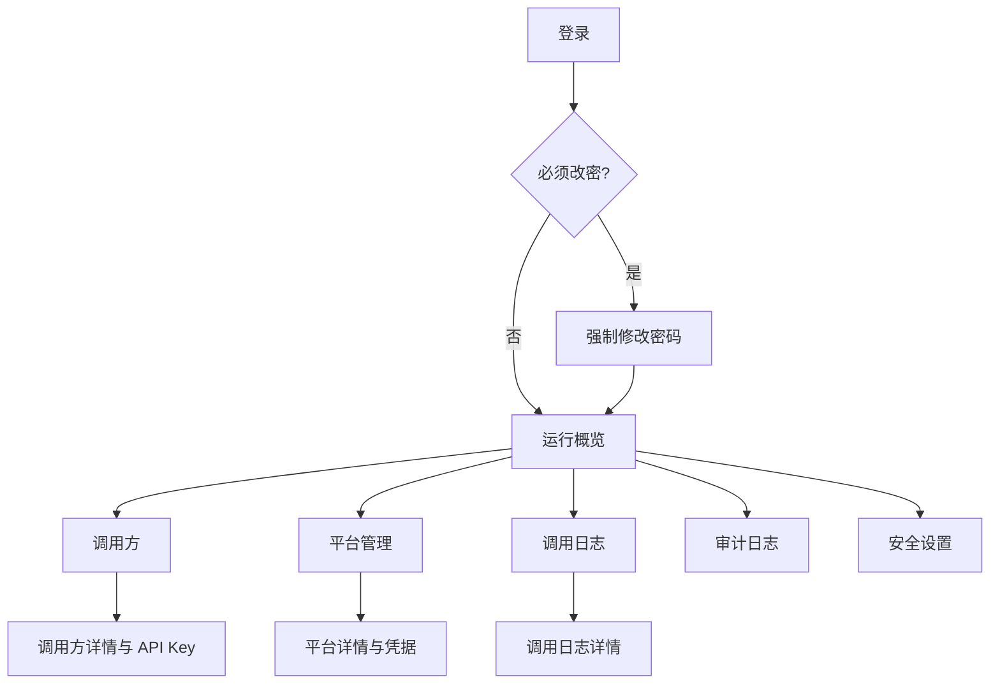

# Media Parser 后台管理界面设计方案

> 文档状态：设计提案  
> 适用服务：`media-parser-ts` 0.1.x  
> 基线日期：2026-08-30（Asia/Shanghai）  
> 交付边界：本文只描述界面与交互，不代表已经创建前端工程或修改 API。

## 1. 结论

后台管理端面向唯一超级管理员，用来维护调用方与 API Key、控制平台状态和凭据、查看解析日志与统计、执行受控平台测试，并完成管理员自身的安全操作。

界面采用“暖白 + 墨绿 + 橙色”的品牌视觉，但信息密度高于公开端。桌面端使用固定工作区和可折叠侧栏，移动端将导航改为抽屉；列表、筛选和详情始终优先保证完整业务信息，不通过截断原始 JSON 来掩盖布局问题。

本文严格区分两类能力：

- **现有能力**：当前 `media-parser-ts` 已有 API，可直接映射到界面。
- **建议能力**：为了完善仪表盘或审计体验建议补充的只读 API；本文不修改服务端实现。

## 2. 产品定位

### 2.1 目标用户

系统只有一个超级管理员，不设计普通管理员、角色管理、部门、租户或 RBAC。

管理员的典型任务：

1. 登录并处理首次强制改密。
2. 创建调用方，为其签发和轮换 API Key。
3. 调整 Key 的每分钟限频、并发、有效期和启用状态。
4. 检查 31 个平台的启用状态、媒体能力和凭据配置情况。
5. 安全更新平台 Cookie，并执行受控连通性测试。
6. 按平台、调用方、状态或 Request ID 检索解析日志。
7. 查看整体成功率、耗时和错误分布，导出限定时间范围的 JSONL。
8. 查看敏感管理操作的审计记录。

### 2.2 成功标准

- 管理员能在不接触数据库和命令行的情况下完成日常管理。
- API Key、Token、密码和平台凭据不会被列表、浏览器存储或日志意外暴露。
- 任何启停、吊销、删除凭据等操作都有明确对象、影响说明和结果反馈。
- 1440px 桌面、1024px 平板与 390px 手机均无页面级横向溢出。
- 当前 API 不支持的能力被清晰标记为“建议”，不以 Mock 数据伪装为真实数据。

### 2.3 非目标

- 不提供普通用户注册、权限分配、计费、配额套餐或审批流。
- 不在后台下载、代理、转码或保存媒体文件。
- 不允许查看平台凭据明文；修改时也不回显旧值。
- 不将管理员 Access Token 或 Refresh Token展示给界面用户。
- 不允许后台绕过平台授权、验证码或隐私要求。

## 3. 设计原则

1. **状态先于装饰**：服务是否就绪、平台是否启用、凭据是否配置、Key 是否可用应一眼可见。
2. **高风险操作可辨识**：禁用、吊销、删除与普通编辑使用不同层级和确认文案。
3. **秘密默认不可见**：只有新建 API Key 成功时展示一次完整值；其他位置只显示掩码。
4. **列表用于定位，详情用于理解**：表格保持高信噪比，长文本、输入与完整响应放入 Drawer。
5. **筛选条件可复核**：日期、时区、平台、调用方和状态在查询结果上方保持可见。
6. **真实边界透明**：Mock、接口错误、服务未就绪和上游测试失败分别表达。
7. **组件使用公开 API**：若未来采用 Ant Design 6，使用一个根 `ConfigProvider` 和主题 Token，不依赖 `.ant-*` 内部选择器。

## 4. 信息架构



### 4.1 路由与导航

| 路由 | 菜单名称 | 主要任务 | API 状态 |
| --- | --- | --- | --- |
| `/login` | 不进入菜单 | 登录 | 现有 |
| `/change-password` | 不进入菜单 | 首次强制改密 | 现有 |
| `/dashboard` | 运行概览 | 查看服务与业务健康度 | 部分现有 |
| `/clients` | 调用方 | 查询、新建和编辑调用方 | 现有 |
| `/clients/:clientId` | 调用方详情 | 管理 API Key | 现有 |
| `/platforms` | 平台管理 | 启停、凭据、受控测试 | 现有 |
| `/logs` | 调用日志 | 筛选、详情与导出 | 现有 |
| `/audit` | 审计日志 | 检索敏感管理操作 | 建议接口 |
| `/settings` | 安全设置 | 管理员资料、改密、退出 | 现有 |

## 5. 全局布局

### 5.1 桌面端

- 左侧导航展开宽度 232px，折叠宽度 72px。
- 顶栏高度 64px，展示当前页面、服务状态、管理员菜单。
- 内容最大宽度 1600px；数据页可以占满剩余宽度。
- 内容容器必须设置 `min-width: 0`，表格横向滚动只发生在表格容器内部。
- 全局提示使用页面右上角消息；需要用户处理的错误保留在当前业务区域。

### 5.2 平板与手机

- 小于 960px 时隐藏固定侧栏，顶栏左侧提供导航抽屉按钮。
- 小于 768px 时筛选区折叠为“筛选”Drawer，主要操作保持在页面标题下方。
- 小于 576px 时统计卡单列或双列，详情 Drawer 占满屏幕。
- 手机端不强行把管理表格变成卡片；保留关键列，并允许表格容器内部滚动。

### 5.3 全局状态

| 状态 | 表达方式 | 行为 |
| --- | --- | --- |
| 首次加载 | 标题和表格骨架屏 | 不闪现空状态 |
| 后台刷新 | 保留旧数据，局部显示刷新中 | 不清空当前筛选和滚动位置 |
| 无数据 | 业务化空状态和推荐下一步 | 例如“创建第一个调用方” |
| 无筛选结果 | 展示当前筛选摘要 | 提供“清除筛选” |
| 无权限/会话失效 | 清除本地界面状态并返回登录 | 不展示敏感页面残影 |
| 服务未就绪 | 顶部持久警告条 | 允许查看管理数据，阻止误判为正常 |
| 接口错误 | 当前区域错误态 + Request ID | 支持重试，不展示堆栈 |

## 6. 页面设计

### 6.1 登录页

#### 布局

桌面端为左右分栏：左侧品牌、产品说明和安全提示，右侧 400px 登录卡片。手机端只保留品牌头和登录卡片。

#### 字段与操作

| 字段/控件 | 规则 |
| --- | --- |
| 用户名 | 必填，3–64 字符，允许密码管理器记忆 |
| 密码 | 必填，使用密码输入框，不提供“记住我” |
| 登录 | 请求中禁用重复提交，Enter 可提交 |

#### 状态

- `401`：显示“用户名或密码错误”，不区分具体字段。
- `429`：显示限流提示与可重试时间。
- 网络错误：保留用户名，清空密码，展示 Request ID（若有）。
- `must_change_password=true`：直接进入强制改密，不允许访问其他路由。

### 6.2 强制修改密码

页面使用单任务卡片，不展示后台导航。

| 字段 | 规则 |
| --- | --- |
| 当前密码 | 必填，不回显 |
| 新密码 | 12–128 字符，实时显示长度要求 |
| 确认新密码 | 必须与新密码一致 |

成功后用服务端返回的新会话替换旧会话，再进入运行概览。失败时不清空新密码以外的上下文，不输出密码规则以外的内部认证细节。

### 6.3 运行概览

#### 页面结构

1. 服务状态条：进程、数据库、加密密钥、Parser 注册与最近刷新时间。
2. 时间范围：最近 24 小时、7 天、30 天；展示时使用浏览器本地时区，查询参数转换为 UTC ISO 时间。
3. KPI：请求总数、成功率、平均耗时、P95 耗时。
4. 趋势区：请求量与成功率折线图。
5. 排行区：平台调用量、调用方调用量。
6. 错误区：错误码分布和最近失败请求入口。

#### 数据真实性

- 当前 `/stats/overview`、`/stats/platforms`、`/stats/clients` 可提供聚合、错误分布和 P50/P95/P99。
- 当前接口不提供时间序列。趋势图在建议接口实现前应显示“暂缺趋势数据”，不能从最多 200 条日志估算总体趋势。
- 无请求时 KPI 显示 `0`；无耗时样本时百分位显示 `—`，不能显示 `0 ms`。

### 6.4 调用方列表

#### 标题区

- 标题：“调用方”及总量。
- 主操作：“新建调用方”。
- 辅助筛选：名称关键字、启用状态；由于当前 API 返回完整列表，筛选可在本地完成。

#### 表格列

| 列 | 表达 |
| --- | --- |
| 名称 | 主标题，可进入详情 |
| 备注 | 最多两行，完整内容放 Tooltip |
| 状态 | 已启用/已停用 Badge |
| Key 数量 | 需要详情请求后才能确认；未取得时显示 `—` |
| 创建时间 | 本地时间，Tooltip 显示 UTC |
| 更新时间 | 本地时间 |
| 操作 | 查看、编辑、启用/停用 |

#### 新建/编辑 Drawer

字段为名称、备注、启用状态。名称 1–100 字符，备注最多 1000 字符。停用调用方前说明其所有 Key 将无法调用解析 API，并要求确认调用方名称。

### 6.5 调用方详情与 API Key

#### 顶部摘要

- 调用方名称、备注、状态、创建时间、更新时间。
- 操作：编辑调用方、新建 API Key。

#### API Key 表格

| 列 | 表达 |
| --- | --- |
| 名称 | Key 用途 |
| 掩码 | 只展示服务端返回的 `masked_key` |
| 状态 | 启用、停用、已过期、已吊销 |
| 每分钟限频 | 整数 |
| 最大并发 | 整数 |
| 过期时间 | 永不过期或本地时间 |
| 最后使用 | 从未使用或本地时间 |
| 创建时间 | 本地时间 |
| 操作 | 编辑、启停、吊销 |

#### 新建 Key

输入名称、每分钟限频、最大并发和可选过期时间。成功后打开不可恢复提示 Modal：

- 明确写明“完整 API Key 只显示这一次”。
- Key 使用等宽字体，默认完整显示，但不进入页面历史、消息通知或日志。
- 提供“复制”按钮和复制结果反馈。
- 关闭前要求勾选“我已安全保存”；不自动下载、不写入浏览器存储。
- Modal 关闭后立即清除组件内的完整 Key，重新进入页面只显示掩码。

#### 编辑与吊销

- 编辑允许修改名称、启用状态、限频、并发和过期时间。
- 吊销为不可逆操作，Modal 显示 Key 名称、掩码、调用方和可选吊销原因。
- 已吊销 Key 不再提供编辑或启用操作。

### 6.6 平台管理

#### 列表布局

默认使用紧凑表格，移动端仍保留表格容器滚动。顶部提供平台名称搜索、启用状态、媒体类型和凭据状态筛选。

| 列 | 表达 |
| --- | --- |
| 平台 | 中文名 + 稳定英文 ID |
| 媒体能力 | 视频、图片、音频、字幕、实况 Tag |
| 状态 | 启用 Switch；修改前确认影响 |
| 凭据 | 无需凭据、未配置、数据库配置、环境配置 |
| 最近测试 | 成功/失败/未测试、耗时和时间 |
| 操作 | 查看详情、运行测试 |

#### 平台详情 Drawer

分为三个区块：

1. 基本信息：名称、ID、媒体能力、启用状态。
2. 凭据：凭据名、是否必须、来源、掩码、更新时间、修改与删除。
3. 连通性测试：默认样例/自定义分享文本、最近测试结果和运行按钮。

#### 凭据交互

- 服务端永远不返回凭据明文，界面也不尝试恢复或缓存旧值。
- 修改凭据时输入框初始为空，说明“保存后只返回掩码”。
- 删除凭据前显示来源；环境变量来源不能通过数据库删除按钮伪装为已移除。
- 删除确认不展示凭据值，只展示平台和凭据名称。

#### 受控测试

- 提交后显示进行中状态并允许取消浏览器请求。
- 同一平台 60 秒冷却期间禁用按钮，并显示可重试倒计时。
- 全局已有测试运行时，对 `409` 给出“另一项测试正在执行”。
- 结果只展示成功、媒体类型、缺失字段、耗时、错误分类和时间，不展示凭据或完整上游响应。

### 6.7 调用日志

#### 筛选条件

| 筛选 | 控件 |
| --- | --- |
| 起止时间 | 日期时间范围，转换为 UTC ISO |
| 调用方 | 可搜索 Select |
| API Key | 先选择调用方后加载对应 Key |
| 平台 | 可搜索 Select |
| 成功状态 | 全部、成功、失败 |
| HTTP 状态 | 100–599 数字输入 |
| retcode | 0–999 数字输入 |
| error_code | 文本输入 |
| request_id | 精确文本输入 |

筛选条件写入 URL 查询参数，但不得把输入全文或响应写入 URL。当前日志 API 使用游标分页，界面使用“加载更多”，不伪造总页数。

#### 表格列

| 列 | 表达 |
| --- | --- |
| 时间 | 本地时间，Tooltip 显示 UTC |
| Request ID | 等宽字体，可复制 |
| 调用方/Key | ID；若已取得名称则并列显示 |
| 平台 | 名称或“识别失败” |
| 状态 | Pending、成功、失败、客户端取消 |
| HTTP/retcode | 紧凑双值 |
| 错误码 | 失败时显示 |
| 耗时 | 毫秒/秒自适应 |
| 操作 | 查看详情 |

#### 日志详情 Drawer

- 摘要：状态、平台、调用方、Key、Request ID、IP、User-Agent、时间和耗时。
- URL：分享 URL 与解析后的真实 URL，安全校验后才能作为外链。
- 原始输入：默认折叠，主动展开后可复制。
- 响应：先呈现结构化业务摘要，再提供折叠的格式化 JSON。
- JSON 长内容在 Drawer 内滚动，不扩张整个页面；不渲染服务端返回的 HTML。

#### 导出

- 打开独立 Modal，起止时间必填且最多 30 天。
- 复用当前筛选，但明确列出最终导出条件。
- 响应按 JSONL 流式下载，界面不将全量文件读入内存。
- 导出行为本身会进入管理审计；失败时展示 Request ID。

### 6.8 审计日志

该页面依赖建议接口，接口实现前显示说明型空页面，不使用 Mock 审计数据。

建议筛选：时间、action、entity_type、outcome、request_id。建议列表列：时间、管理员、操作、实体、结果、来源 IP、Request ID。脱敏元数据放在详情 Drawer 中。

审计页不得展示密码、Token、完整 API Key、Cookie、凭据值或这些字段的更新前后差异。

### 6.9 安全设置

#### 管理员资料

展示管理员 ID、用户名和当前会话状态，不展示 Token、密码更新时间以外的秘密信息。

#### 修改密码

字段与强制改密一致。成功后服务端返回新 Token 对，界面替换当前会话，并使旧会话不可继续使用。

#### 退出

调用退出 API 后，无论响应成功与否都清除后台 Web 会话并跳转登录页。页面卸载前不在控制台打印会话对象。

#### 服务状态

展示 `/api/health` 与 `/api/ready` 的最近检查结果。`ready=503` 只能显示公开就绪信息，不推断或暴露加密密钥内容、数据库路径或内部异常。

## 7. 组件与视觉语言

### 7.1 组件层级建议

若未来实现为 Ant Design 6 CSR 应用，建议只使用公开组件 API：

| 场景 | 建议组件 |
| --- | --- |
| 应用骨架 | `Layout`、`Menu`、`Breadcrumb` |
| 数据摘要 | `Card`、`Statistic`、`Progress` |
| 数据列表 | `Table`、`Tag`、`Badge`、`Tooltip` |
| 编辑 | `Form`、`Input`、`InputNumber`、`DatePicker`、`Select`、`Switch` |
| 详情 | `Drawer`、`Descriptions`、`Collapse` |
| 确认 | `Modal`、`Alert` |
| 状态 | `Skeleton`、`Spin`、`Empty`、`Result` |
| 辅助操作 | `Dropdown`、`Button`、`Segmented` |

使用一个根 `ConfigProvider` 注入全局 Token；局部差异优先用组件 Token，再用 `styles`/`classNames`。表格必须有稳定 `rowKey`。远程搜索 Select 关闭本地过滤，避免结果被二次过滤。

### 7.2 品牌 Token

| Token | 值 | 用途 |
| --- | --- | --- |
| `colorInk` | `#18211D` | 主文字、侧栏品牌色 |
| `colorInkSoft` | `#35423B` | 次级深色区域 |
| `colorCanvas` | `#F3F5F0` | 页面背景 |
| `colorSurface` | `#FFFFFF` | 卡片与表格背景 |
| `colorSurfaceWarm` | `#F9FAF6` | 筛选和次级面板 |
| `colorPrimary` | `#E85D35` | 主按钮、选中和关键强调 |
| `colorPrimaryHover` | `#C94825` | 主操作悬停 |
| `colorSuccess` | `#167A59` | 成功、已就绪 |
| `colorWarning` | `#B86A12` | 待处理、即将过期 |
| `colorError` | `#B83A3A` | 失败、吊销、删除 |
| `colorInfo` | `#2F6F91` | 中性信息 |
| `colorBorder` | `#D9DED7` | 边框与分隔线 |
| `colorTextSecondary` | `#68736D` | 次级文字 |

### 7.3 排版与尺寸

| 项目 | 规范 |
| --- | --- |
| 字体 | `Inter`, `ui-sans-serif`, 系统无衬线字体 |
| 等宽字体 | `SFMono-Regular`, `Menlo`, `Consolas`, monospace |
| 页面标题 | 28px / 36px，600–700 |
| 区块标题 | 18px / 26px，600 |
| 正文 | 14px / 22px |
| 表格正文 | 13px / 20px |
| 辅助文字 | 12px / 18px |
| 基础间距 | 4px，常用 8/12/16/24/32 |
| 卡片圆角 | 14px |
| 输入/按钮圆角 | 9px |
| Drawer 宽度 | 桌面 640px；日志详情 760px；手机 100% |
| 阴影 | `0 14px 36px rgb(24 33 29 / 8%)` |

橙色只用于主要操作、当前选中和少量品牌强调，不用于大面积背景。危险操作始终使用错误色，不能仅依赖橙色深浅区分。

## 8. 线框图

### 8.1 桌面端：运行概览

```text
┌───────────────┬─────────────────────────────────────────────────────────────┐
│ MP Media      │ 运行概览                         ● 服务就绪   admin ▾       │
│ Parser        ├─────────────────────────────────────────────────────────────┤
│               │ [最近24小时] [7天] [30天]                     刷新          │
│ ● 运行概览    │                                                             │
│   调用方      │ ┌──────────┐ ┌──────────┐ ┌──────────┐ ┌──────────┐        │
│   平台管理    │ │ 请求总数 │ │ 成功率   │ │ 平均耗时 │ │ P95      │        │
│   调用日志    │ └──────────┘ └──────────┘ └──────────┘ └──────────┘        │
│   审计日志    │                                                             │
│   安全设置    │ ┌────────────────────────────┐ ┌────────────────────────┐  │
│               │ │ 请求量 / 成功率趋势        │ │ 错误分布               │  │
│               │ │                            │ │                        │  │
│               │ └────────────────────────────┘ └────────────────────────┘  │
│               │ ┌────────────────────────────┐ ┌────────────────────────┐  │
│               │ │ 平台排行                   │ │ 调用方排行             │  │
│               │ └────────────────────────────┘ └────────────────────────┘  │
└───────────────┴─────────────────────────────────────────────────────────────┘
```

### 8.2 桌面端：调用日志

```text
┌───────────────┬─────────────────────────────────────────────────────────────┐
│ 导航          │ 调用日志                                      [导出 JSONL] │
│               │ ┌─────────────────────────────────────────────────────────┐ │
│               │ │ 时间范围  调用方  Key  平台  状态  Request ID  [查询] │ │
│               │ └─────────────────────────────────────────────────────────┘ │
│               │ ┌─────────────────────────────────────────────────────────┐ │
│               │ │ 时间 │ Request ID │ 调用方 │ 平台 │ 状态 │ 耗时 │ 操作│ │
│               │ │ ...                                                   │ │
│               │ │ ...                                                   │ │
│               │ └─────────────────────────────────────────────────────────┘ │
│               │                         [加载更多]                          │
└───────────────┴─────────────────────────────────────────────────────────────┘
```

### 8.3 平板端

```text
┌──────────────────────────────────────────────────────────────┐
│ ☰  调用方详情                              ● 就绪  admin ▾   │
├──────────────────────────────────────────────────────────────┤
│ 调用方名称 / 状态                             [编辑] [新建Key]│
│ ┌──────────────────────────────────────────────────────────┐ │
│ │ 调用方摘要                                               │ │
│ └──────────────────────────────────────────────────────────┘ │
│ ┌──────────────────────────────────────────────────────────┐ │
│ │ API Key 表格（容器内横向滚动）                           │ │
│ └──────────────────────────────────────────────────────────┘ │
└──────────────────────────────────────────────────────────────┘
```

### 8.4 手机端

```text
┌──────────────────────────────┐
│ ☰  平台管理        ● 就绪   │
├──────────────────────────────┤
│ 平台管理                     │
│ [搜索平台____________] [筛选]│
│                              │
│ ┌──────────────────────────┐ │
│ │ 表格容器 →               │ │
│ │ 平台  状态  凭据  操作   │ │
│ │ ...                      │ │
│ └──────────────────────────┘ │
│                              │
│ 详情 Drawer：全屏            │
└──────────────────────────────┘
```

## 9. API 映射

### 9.1 当前可用接口

| 界面功能 | 方法与路径 | 关键行为 |
| --- | --- | --- |
| 登录 | `POST /api/admin/v1/auth/login` | 返回 Token 对和强制改密状态 |
| 刷新 | `POST /api/admin/v1/auth/refresh` | Refresh Token 轮换 |
| 当前管理员 | `GET /api/admin/v1/auth/me` | 获取 ID、用户名、改密状态 |
| 修改密码 | `PUT /api/admin/v1/auth/password` | 返回新的 Token 对 |
| 退出 | `POST /api/admin/v1/auth/logout` | 吊销当前会话 |
| 调用方列表/新建 | `GET/POST /api/admin/v1/clients` | 列出或创建调用方 |
| 调用方详情/编辑 | `GET/PATCH /api/admin/v1/clients/{clientId}` | 查询或修改调用方 |
| Key 列表/新建 | `GET/POST /api/admin/v1/clients/{clientId}/keys` | 完整 Key 仅创建时返回 |
| Key 编辑 | `PATCH /api/admin/v1/keys/{keyId}` | 修改启用、限频、并发等 |
| Key 吊销 | `POST /api/admin/v1/keys/{keyId}/revoke` | 不可逆吊销 |
| 平台列表 | `GET /api/admin/v1/platforms` | 返回媒体类型、凭据掩码和最近测试 |
| 平台启停 | `PATCH /api/admin/v1/platforms/{platformId}` | 修改 `enabled` |
| 凭据设置/删除 | `PUT/DELETE /api/admin/v1/platforms/{platformId}/credentials/{credentialName}` | 明文只写入，不返回 |
| 平台测试 | `POST /api/admin/v1/platforms/{platformId}/test` | 全局串行、单平台冷却 60 秒 |
| 日志列表 | `GET /api/admin/v1/logs` | 多条件筛选、游标分页 |
| 日志详情 | `GET /api/admin/v1/logs/{logId}` | 包含输入与完整响应 |
| 日志导出 | `GET /api/admin/v1/logs/export` | 起止时间必填，最多 30 天，JSONL |
| 汇总统计 | `GET /api/admin/v1/stats/overview` | 聚合、错误和百分位 |
| 平台统计 | `GET /api/admin/v1/stats/platforms` | 按平台分组 |
| 调用方统计 | `GET /api/admin/v1/stats/clients` | 按调用方分组 |
| 存活/就绪 | `GET /api/health`、`GET /api/ready` | 公开健康状态 |

### 9.2 建议补充接口

这些接口只记录为设计建议：

#### `GET /api/admin/v1/stats/timeseries`

建议参数：

```text
from=<UTC ISO>&to=<UTC ISO>&bucket=hour|day
```

建议响应：

```json
{
  "data": {
    "buckets": [
      {
        "started_at": "2026-08-30T00:00:00.000Z",
        "total": 120,
        "successful": 112,
        "failed": 8,
        "average_duration_ms": 1380
      }
    ]
  },
  "request_id": "..."
}
```

服务端应补齐空时间桶；小时粒度最多 7 天，天粒度最多 31 天。

#### `GET /api/admin/v1/audit-logs`

建议参数：`from`、`to`、`action`、`entity_type`、`outcome`、`request_id`、`cursor`、`limit`。

建议响应项只包含已脱敏字段：`id`、`request_id`、`admin_id`、`action`、`entity_type`、`entity_id`、`outcome`、`request_ip`、`metadata`、`created_at`，并返回 `next_cursor`。

## 10. 安全设计

### 10.1 会话

推荐未来由后台 Web 的同源 BFF 管理核心 API Token：

- Access/Refresh Token 只存在服务端或加密的 `HttpOnly` Cookie。
- Cookie 使用 `Secure`、`SameSite=Strict` 和限定 Path。
- 写操作校验精确 Origin，并使用 CSRF Token。
- Access 过期后最多刷新和重试一次；刷新失败立即退出。
- 不把 Token 写入 LocalStorage、SessionStorage、URL、页面 JSON 或客户端日志。

该 BFF 是设计建议，不属于本文交付实现。

### 10.2 敏感信息

- 密码输入不提供明文常驻显示，不复制到普通文本组件。
- 完整 API Key 只在创建成功时短暂存在组件内存。
- 凭据只显示服务端掩码，更新字段永远从空值开始。
- 日志详情的原始输入与完整响应默认折叠。
- 复制操作必须由管理员主动触发，并提供明确的复制成功反馈。
- 运行日志、审计元数据和错误提示禁止包含秘密值。

### 10.3 外链与富内容

- 日志中的 URL 仅允许 `http:` 与 `https:`，统一使用新窗口和 `noopener noreferrer`。
- JSON 以文本格式化展示，不用 `innerHTML`。
- User-Agent、备注、输入文本和上游标题均按不可信文本处理。

## 11. 响应式与可访问性

### 11.1 断点

| 宽度 | 行为 |
| --- | --- |
| `>= 1280px` | 展开侧栏、四列 KPI、双列图表 |
| `960–1279px` | 可折叠侧栏、两列 KPI、双列或单列图表 |
| `768–959px` | 导航 Drawer、两列 KPI、筛选可折叠 |
| `< 768px` | 单列内容、全屏详情 Drawer、表格容器滚动 |
| `< 576px` | 紧凑页边距 16px、主操作占满宽度 |

### 11.2 可访问性要求

- 页面保持唯一、层级连续的标题结构。
- 所有图标按钮有可读名称，不能只依靠 Tooltip。
- 表单错误与字段建立程序关联，提交后聚焦首个错误。
- Switch 同时展示文字状态，不能只依赖颜色。
- 成功、警告、失败同时使用图标/文字/颜色。
- Drawer 与 Modal 打开后锁定焦点，关闭后焦点返回触发按钮。
- 支持键盘完成登录、筛选、表格操作、确认和关闭。
- 动效遵守 `prefers-reduced-motion`；刷新不造成大面积布局跳动。
- 图表提供等价的数据表或可读摘要。

## 12. 推荐文案

| 场景 | 文案 |
| --- | --- |
| 新 Key | “请立即安全保存。完整 API Key 只显示这一次，关闭后无法恢复。” |
| 停用调用方 | “停用后，该调用方下的所有 API Key 将无法发起解析请求。” |
| 吊销 Key | “吊销不可撤销。如需恢复访问，请创建新的 API Key。” |
| 删除凭据 | “删除数据库凭据后，平台可能回退到环境变量配置或失去授权能力。” |
| 平台测试 | “测试会访问真实上游，并受全局串行和 60 秒冷却限制。” |
| 日志导出 | “导出包含所选范围内的完整输入与响应，请按敏感数据妥善保存。” |
| 服务未就绪 | “服务进程存活，但依赖尚未就绪。部分操作可能失败。” |

## 13. 验收清单

### 功能与信息

- [ ] 所有现有管理 API 都有明确的页面入口或说明。
- [ ] 建议接口与现有接口有清晰标记，不使用假趋势或假审计数据。
- [ ] 强制改密期间无法进入其他管理页面。
- [ ] 日志列表使用游标加载，不展示虚假的总页数。
- [ ] 时间筛选明确本地显示与 UTC 查询转换。

### 安全

- [ ] 完整 API Key 只显示一次，关闭后不能从界面恢复。
- [ ] 列表、通知、URL 和日志不出现密码、Token、完整 Key 或凭据。
- [ ] 凭据编辑不回填旧明文。
- [ ] 危险操作说明对象、影响和不可逆性。
- [ ] 原始输入与完整响应默认折叠。

### 布局与可访问性

- [ ] 1440px、1024px、768px、390px 均无页面级横向溢出。
- [ ] 表格只在自身容器横向滚动，详情内容不撑开主布局。
- [ ] 键盘和屏幕阅读器能完成核心流程。
- [ ] 状态表达不只依赖颜色。
- [ ] 图表存在文字摘要或表格替代。

### 文档边界

- [ ] 本文不承诺已创建后台应用、BFF、建议接口或任何部署配置。
- [ ] 实现时仍需基于当时实际 OpenAPI 和 Ant Design 版本核对组件 API。

