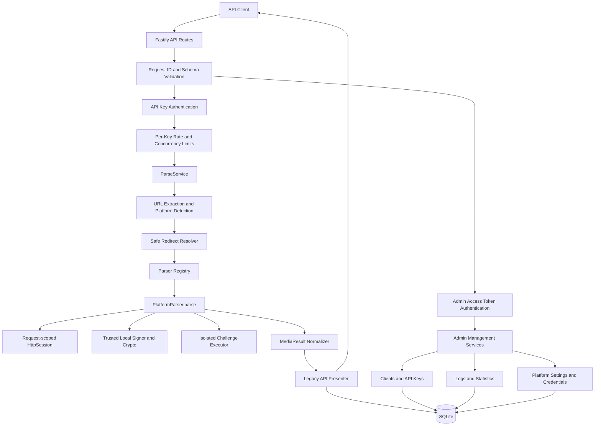

# Media Parser Node.js + TypeScript API 重构设计方案

> 状态：已决策设计
>
> 本文仅描述目标方案，不代表已经创建 Node.js 项目或修改现有 Python 实现。

## 1. 结论

在 `/root/media-parser-ts` 建设一个独立的 Node.js + TypeScript API 服务。新服务不包含首页、管理页面、模板或静态资源，只提供业务 API、管理 API、健康检查和就绪检查。

现有 `/root/mediatool/media-parser` 继续作为功能基线。31 个平台全部迁移并完成契约、双栈和真实网络验证后，再进行一次整体切换；迁移期间不按平台混合承载生产流量。

已锁定的核心决策：

- 保留现有 `POST /api/parse` 请求与响应结构。
- 所有解析调用必须携带独立 API Key。
- 每个 API Key 支持启停、过期、吊销、每分钟限频和最大并发限制。
- 管理能力只通过 API 提供，不开发管理端界面。
- 只设置一个超级管理员，采用用户名密码、短期 Access Token 和可轮换 Refresh Token。
- 使用单实例 SQLite 保存管理员、调用方、API Key、平台配置、完整调用日志和审计日志。
- 已鉴权调用的原始分享文本和完整解析结果在 SQLite 中明文保留 30 天。
- API Key 和管理员 Token 只保存哈希。
- 平台 Cookie 由管理 API 维护，使用 AES-256-GCM 加密保存，查询时只返回掩码。
- 新旧服务独立开发，全部完成后整体切换。

## 2. 目标与非目标

### 2.1 目标

- 用严格 TypeScript 类型表达解析结果、错误、鉴权身份和管理资源。
- 将同步构造函数抓取改为显式、异步、可取消的 `parse()` 生命周期。
- 保持 31 个平台的识别、跳转、视频、图集、实况、音频和字幕能力。
- 以 API Key 区分调用方，并提供完整的创建、轮换、禁用、吊销和审计能力。
- 提供单一超级管理员的登录、改密、刷新和退出 API。
- 提供调用日志查询、详情、统计和 JSONL 导出 API。
- 提供平台启停、凭据设置和受控连通性测试 API。
- 让 Cookie、请求头、超时、取消信号和日志上下文保持请求级隔离。
- 复用已有字节系 JavaScript 签名算法，移除 Python 的 V8 桥接依赖。
- 建立单元、API 契约、Python/Node 对照、真实样例和安全测试。
- 提供整体切换、限时回滚和最终清理路径。

### 2.2 非目标

- 不实现任何 Web 页面或管理界面。
- 不迁移现有 `templates/`、`static/` 和首页路由。
- 不新增用户注册、普通用户登录或多角色 RBAC。
- 不新增数据库外部依赖，不支持首版多实例写入。
- 不新增媒体下载代理、文件存储、转码或合并能力。
- 不新增日/月商业配额、计费或支付能力。
- 不引入第三方媒体解析 SaaS。
- 不使用浏览器自动化绕过登录、验证码或平台授权流程。
- 不改变或绕过豆包、视频号等平台的合法登录态要求。
- 不承诺语言迁移可以规避平台新增的风控策略。

## 3. 当前基线与迁移风险

当前 Python 项目包含 31 个平台注册、约 5300 行生产 Python 代码、两份字节系签名 JavaScript 和 119 个可通过的本地测试。

现有实现的关键特征：

- Flask 提供首页、健康检查和解析接口，Gunicorn 运行生产服务。
- `ParserFactory` 动态扫描 Python 模块并用装饰器注册解析器。
- 每个 `BaseParser` 创建独立 `requests.Session`。
- 多数 Parser 在构造函数中同步请求上游，再由多个 `get_*()` 方法读取结果。
- 抖音通过 mini-racer 执行本地 `a_bogus.js` 和 `x_bogus.js`。
- 豆包包含 AES-CBC 解密、多接口回退和授权 Cookie 流程。
- 腾讯频道会执行上游页面返回的 JavaScript 挑战代码。
- 本地自动测试主要使用 Mock；真实网络验证由独立脚本执行。

迁移主要风险不在 TypeScript 语法，而在不同 HTTP 客户端对 Cookie、重定向、表单编码、响应解压、最终 URL、TLS 和连接复用的处理差异。这些差异可能改变平台风控结果，因此不能仅凭编译和 Mock 测试判定迁移成功。

迁移前需要纳入验收的问题：

1. 快手解析器源码中疑似存在完整硬编码 Cookie，新项目不得复制该值。
2. 抖音请求存在关闭 TLS 证书验证的行为，新项目不得继承。
3. 文档中的部分旧示例与实际 `retcode/retdesc/succ` 契约不一致，以运行代码和契约测试为准。
4. AcFun、抖音、好看视频、梨视频、皮皮搞笑、微视、小红书需要补齐独立解析器测试。
5. 旧实现会静默吞掉部分字段异常，新实现需要记录字段失败，但保持“取得任意媒体即成功”的兼容规则。

## 4. 技术选型

| 领域 | 选择 | 说明 |
| --- | --- | --- |
| 运行时 | Node.js 24 LTS | 开发、CI 和镜像固定同一主版本 |
| 模块体系 | ESM | 便于直接包装已有签名 JavaScript |
| 语言 | TypeScript strict | 开启严格空值、未检查索引和精确可选属性检查 |
| Web 框架 | Fastify 5 | 提供轻量路由、JSON Schema 和结构化日志集成 |
| HTTP | Got + Tough Cookie | 提供 Cookie Jar、重定向控制、超时和最终 URL |
| HTML | Cheerio | 替代 BeautifulSoup/lxml 的 DOM 查询 |
| 数据库 | better-sqlite3 | 单进程 SQLite，使用 WAL 和显式事务 |
| 加密 | `node:crypto` | 提供 scrypt、SHA-256、AES-CBC、AES-256-GCM 和随机数 |
| 限流 | `@fastify/rate-limit` | 按已认证 API Key 执行动态每分钟限流 |
| 日志 | Pino/Fastify Logger | 输出脱敏 JSON 运行日志 |
| 测试 | Vitest | 单元、Mock、契约和双栈 fixture 对照 |
| 构建 | `tsc` | 生产环境只运行编译产物 |
| 包管理 | pnpm + lockfile | CI 使用冻结锁文件安装 |

依赖在实际实现时锁定到 `pnpm-lock.yaml`，部署不使用浮动的 `latest`。首版不引入 ORM、Redis、Playwright、Puppeteer 或管理端 UI 依赖。

## 5. 目标架构



边界原则：

- Fastify Route 只负责鉴权入口、Schema 和 HTTP 映射。
- `ParseService` 负责编排 URL、平台、Parser、标准化和日志落库。
- Parser 只负责一个平台的请求协议和数据映射。
- API Key、管理员身份和平台凭据由不同服务管理。
- SQLite Repository 不允许直接被 Route 调用。
- 运行日志与可查询业务日志分离。
- Parser 不读取任意环境变量，只通过类型化配置取得允许的凭据。

## 6. 独立项目目录

```text
/root/
├── mediatool/
│   └── media-parser/                # 现有 Python 基线，不在重构中修改
└── media-parser-ts/                 # 独立 API 项目
    ├── docs/
    │   └── nodejs-typescript-refactor-design.md
    ├── src/
    │   ├── server.ts                # 监听、信号和优雅退出
    │   ├── app.ts                   # Fastify 应用工厂
    │   ├── api/
    │   │   ├── public/              # health、ready、parse
    │   │   ├── admin/               # 管理 API
    │   │   ├── schemas/             # JSON Schema
    │   │   └── presenter.ts         # 内部模型映射到旧 API 契约
    │   ├── auth/
    │   │   ├── api-key-service.ts
    │   │   ├── admin-auth-service.ts
    │   │   ├── password.ts
    │   │   └── tokens.ts
    │   ├── core/
    │   │   ├── media-result.ts
    │   │   ├── parser.ts
    │   │   ├── parser-registry.ts
    │   │   ├── parse-context.ts
    │   │   ├── parse-service.ts
    │   │   └── errors.ts
    │   ├── config/
    │   │   ├── env.ts
    │   │   ├── platforms.ts
    │   │   └── user-agents.ts
    │   ├── database/
    │   │   ├── connection.ts
    │   │   ├── migrations/
    │   │   └── repositories/
    │   ├── http/
    │   │   ├── http-session.ts
    │   │   ├── redirect-resolver.ts
    │   │   ├── outbound-policy.ts
    │   │   └── response-reader.ts
    │   ├── logging/
    │   │   ├── request-log-service.ts
    │   │   ├── audit-log-service.ts
    │   │   ├── retention-service.ts
    │   │   └── redact.ts
    │   ├── platform-admin/
    │   │   ├── platform-service.ts
    │   │   ├── credential-service.ts
    │   │   └── platform-test-service.ts
    │   ├── platforms/               # 31 个平台 Parser
    │   ├── security/
    │   │   ├── encryption.ts
    │   │   └── challenge-executor.ts
    │   └── signers/
    │       └── bytedance/
    ├── tests/
    │   ├── unit/
    │   ├── contract/
    │   ├── parity/
    │   ├── security/
    │   ├── live/
    │   └── fixtures/
    ├── scripts/
    │   └── verify-live.ts
    ├── openapi/
    │   └── openapi.yaml
    ├── package.json
    ├── pnpm-lock.yaml
    ├── tsconfig.json
    └── Dockerfile
```

不创建 `web/`、`templates/`、`static/` 或管理端应用。禁止新增职责模糊的 `common.ts`、`misc.ts` 或总包式 `utils.ts`。

## 7. 核心类型与解析生命周期

### 7.1 内部媒体结果

内部字段使用 camelCase，只有兼容 Presenter 输出 snake_case。

```ts
export interface AuthorInfo {
  nickname: string;
  authorId: string;
  avatar: string;
  guildName?: string;
}

export interface LivePhoto {
  url: string | null;
  livePhotoUrl: string | null;
}

export type ImageItem = string | LivePhoto;

export interface SubtitleItem {
  text: string;
  startMs?: number;
  endMs?: number;
}

export interface MediaResult {
  title: string;
  videoUrl: string | null;
  videoList: string[];
  audioUrl: string | null;
  coverUrl: string | null;
  author: AuthorInfo | null;
  imageList: ImageItem[];
  subtitles: SubtitleItem[] | null;
}
```

所有 Parser 都返回完整 `MediaResult`，缺失字段使用 `null`、空字符串或空数组中的约定值，不用 `undefined` 表达业务缺失。

### 7.2 Parser 接口

```ts
export interface PlatformParser {
  readonly platform: PlatformName;
  parse(context: ParseContext): Promise<MediaResult>;
}

export type ParserFactory = (context: ParseContext) => PlatformParser;
```

Parser 构造函数只能保存依赖和 URL，禁止发起网络请求。所有 I/O 必须位于可等待、可取消、可观测的 `parse()` 中。

### 7.3 ParseContext

```ts
export interface ParseContext {
  requestId: string;
  apiClientId: string;
  apiKeyId: string;
  platform: PlatformName;
  originalUrl: URL;
  realUrl: URL;
  session: HttpSession;
  signal: AbortSignal;
  logger: ParserLogger;
  credentials: PlatformCredentials;
}
```

每个解析请求创建独立 `HttpSession` 和 Cookie Jar。连接池可以共享，但 Cookie、临时 Token、Headers 和 Parser 状态不得跨请求共享。

### 7.4 显式注册表

```ts
export const parserRegistry = {
  douyin: (context) => new DouyinParser(context),
  xigua: (context) => new XiguaParser(context),
  kuaishou: (context) => new KuaishouParser(context),
  // 其余平台
} satisfies Record<PlatformId, ParserFactory>;
```

平台使用稳定英文 `platformId` 作为数据库、配置和管理 API 标识，中文名称仅用于响应展示。编译器和测试共同保证所有已配置平台恰好注册一次。

## 8. 业务 API 与 API Key

### 8.1 路由

#### `GET /api/health`

- 不需要鉴权。
- 只判断进程是否存活。
- HTTP 200：`{"status":"ok"}`。

#### `GET /api/ready`

- 不需要鉴权。
- 检查数据库可读写、迁移版本和平台凭据加密密钥状态。
- 就绪返回 HTTP 200；未就绪返回 HTTP 503，不返回内部秘密或异常堆栈。

#### `POST /api/parse`

- Header：`Authorization: Bearer mp_<key-id>_<secret>`。
- 不允许通过 Query、Cookie 或请求 Body 传递 API Key。
- Body 保持 `{ "text": "分享文案或 URL" }`。
- `text` 必须是非空字符串，最大 2000 个字符。
- 响应继续使用现有 `retcode/retdesc/data/succ/error_code`。

成功示例：

```json
{
  "retcode": 200,
  "retdesc": "成功",
  "data": {
    "video_id": "7616399587141737704",
    "platform": "抖音",
    "title": "示例标题",
    "video_url": "https://example.invalid/video.mp4",
    "audio_url": null,
    "cover_url": "https://example.invalid/cover.jpg",
    "author": {
      "nickname": "示例作者",
      "author_id": "123",
      "avatar": "https://example.invalid/avatar.jpg"
    },
    "image_list": []
  },
  "succ": true
}
```

兼容规则：

- `video_list` 只有在去重后存在两个及以上视频时才返回。
- 主 `video_url` 在 `video_list` 中时必须位于第一项。
- `subtitles` 仅在非空时返回。
- `image_list` 允许字符串或 `{url, live_photo_url}`。
- 仅把明确以 `http://` 开头的媒体 URL 转换为 HTTPS。
- 取得视频、视频列表或图集任意一种即视为媒体提取成功。

新增错误：

| HTTP | `error_code` | 条件 |
| ---: | --- | --- |
| 401 | `UNAUTHORIZED` | API Key 缺失、无效、禁用、吊销、过期或调用方禁用 |
| 429 | `RATE_LIMITED` | 超过该 Key 每分钟调用次数 |
| 429 | `CONCURRENCY_LIMITED` | 超过该 Key 最大并发数 |
| 503 | `PLATFORM_DISABLED` | 平台被管理员停用 |
| 503 | `LOG_STORAGE_UNAVAILABLE` | 无法创建本次调用日志，解析未开始 |

认证失败统一返回相同文案，不能帮助调用方枚举 Key 状态。限流响应包含 `Retry-After` 和限流响应头。

### 8.2 API Key 生命周期

- Key 格式为 `mp_<key-id>_<random-secret>`。
- Secret 使用密码学安全随机源，至少 256 bit。
- 数据库存储稳定 Key ID、可显示前缀和完整 Key 的 SHA-256 哈希。
- 认证时按 Key ID 查找，再用 timing-safe compare 比较哈希。
- 明文 Key 只在创建响应中返回一次，之后无法读取。
- 轮换通过“创建新 Key、验证调用、吊销旧 Key”完成。
- API Client 和 API Key 均采用软禁用；Key 额外支持不可逆吊销。
- 默认每个 Key 为 30 次/分钟、最大并发 3。
- 全服务默认最大解析并发 20。
- 限频使用进程内存存储，进程重启后窗口重置；SQLite 单实例方案不引入 Redis。
- 并发计数必须在成功、异常、取消和客户端断开时通过 `finally` 释放。

## 9. 管理员认证与管理 API

管理 API 前缀统一为 `/api/admin/v1`，使用独立管理员 Access Token，不接受业务 API Key。

### 9.1 管理员认证

首版只允许一个超级管理员：

- `POST /api/admin/v1/auth/login`
- `POST /api/admin/v1/auth/refresh`
- `POST /api/admin/v1/auth/logout`
- `GET /api/admin/v1/auth/me`
- `PUT /api/admin/v1/auth/password`

认证规则：

- 初次启动从 `ADMIN_BOOTSTRAP_USERNAME` 和 `ADMIN_BOOTSTRAP_PASSWORD` 创建管理员。
- 数据库中不存在管理员且缺少引导凭据时，服务拒绝启动。
- 引导管理员首次登录后只能调用 `me`、`password`、`refresh` 和 `logout`，完成改密后才能使用其他管理 API。
- 密码最少 12、最多 128 个字符，使用异步 scrypt 和随机盐保存。
- Access Token 为不透明随机 Token，有效期 15 分钟。
- Refresh Token 为不透明随机 Token，有效期 7 天。
- 两类 Token 在数据库中只保存哈希。
- Refresh Token 每次使用后轮换；检测到旧 Refresh Token 重用时，吊销整个 Token family。
- 修改密码后吊销除当前换发会话外的所有会话。
- 登录失败按“规范化用户名 + 可信客户端 IP”限制为 15 分钟内 5 次。
- 日志不得出现密码或任何明文 Token。

登录响应：

```json
{
  "data": {
    "access_token": "ma_access_...",
    "access_expires_in": 900,
    "refresh_token": "ma_refresh_...",
    "refresh_expires_in": 604800,
    "token_type": "Bearer",
    "must_change_password": true
  },
  "request_id": "01..."
}
```

### 9.2 调用方与 Key 管理

- `GET /api/admin/v1/clients`
- `POST /api/admin/v1/clients`
- `GET /api/admin/v1/clients/:clientId`
- `PATCH /api/admin/v1/clients/:clientId`
- `GET /api/admin/v1/clients/:clientId/keys`
- `POST /api/admin/v1/clients/:clientId/keys`
- `PATCH /api/admin/v1/keys/:keyId`
- `POST /api/admin/v1/keys/:keyId/revoke`

Client 包含名称、备注和启用状态。Key 包含名称、掩码、启用状态、每分钟限制、最大并发、可选过期时间、最后使用时间和吊销时间。

不提供 Client 或 Key 的物理删除接口。创建 Key 的响应是唯一返回完整 Key 的地方；列表和详情只返回掩码。

### 9.3 平台管理

- `GET /api/admin/v1/platforms`
- `PATCH /api/admin/v1/platforms/:platformId`
- `PUT /api/admin/v1/platforms/:platformId/credentials/:credentialName`
- `DELETE /api/admin/v1/platforms/:platformId/credentials/:credentialName`
- `POST /api/admin/v1/platforms/:platformId/test`

平台列表返回：

- 稳定英文 ID 和中文名称。
- 是否启用。
- 支持的媒体类型。
- 是否需要或可选凭据。
- 凭据是否配置、来源、掩码和更新时间。
- 最近一次测试的状态、时间、耗时和错误分类。

平台测试规则：

- Body 可提供 `text`；未提供时使用登记的默认真实样例。
- 输入仍经过 URL 和 SSRF 校验。
- 测试使用当前平台凭据，但响应和日志不暴露凭据。
- 全服务同时只运行一个管理测试。
- 同一平台测试冷却 60 秒。
- 返回平台、成功状态、检测到的媒体类型、缺失字段、耗时和错误分类，不返回 Cookie。

### 9.4 日志与统计

- `GET /api/admin/v1/logs`
- `GET /api/admin/v1/logs/export`
- `GET /api/admin/v1/logs/:logId`
- `GET /api/admin/v1/stats/overview`
- `GET /api/admin/v1/stats/platforms`
- `GET /api/admin/v1/stats/clients`

日志列表支持：

- UTC 起止时间。
- Client ID、Key ID。
- 平台 ID。
- 成功状态。
- HTTP 状态、`retcode`、`error_code`。
- Request ID。
- 游标分页，默认 50 条、最大 200 条。

列表不返回完整输入和完整响应；单条详情返回。导出沿用相同过滤条件，流式输出 `application/x-ndjson`，单次时间跨度不能超过 30 天。

统计接口按时间范围聚合调用数、成功率、错误分类、平均和分位耗时、平台分布及 Client 用量，不提供商业配额或费用数据。

### 9.5 管理 API 响应约定

成功：

```json
{
  "data": {},
  "request_id": "01..."
}
```

失败：

```json
{
  "error": {
    "code": "ADMIN_UNAUTHORIZED",
    "message": "管理员认证失败"
  },
  "request_id": "01..."
}
```

所有管理资源 ID 使用 ULID，时间使用 UTC ISO 8601，JSON Schema 默认拒绝未知字段。

## 10. SQLite 数据设计

数据库默认路径为 `/app/data/media-parser.sqlite`，开启：

```sql
PRAGMA journal_mode = WAL;
PRAGMA foreign_keys = ON;
PRAGMA busy_timeout = 5000;
```

使用显式版本迁移，启动时按顺序执行；失败时就绪检查返回失败，服务不接收业务请求。

### 10.1 表结构

#### `schema_migrations`

- `version`：迁移版本主键。
- `applied_at`：执行时间。

#### `admins`

- `id`、`username`。
- `password_hash`、`password_salt`、`password_params_json`。
- `must_change_password`、`created_at`、`updated_at`。

该表最多保留一个有效管理员，Repository 层拒绝创建第二个管理员。

#### `admin_sessions`

- `id`、`admin_id`、`family_id`。
- `access_token_hash`、`access_expires_at`。
- `refresh_token_hash`、`refresh_expires_at`。
- `created_at`、`last_used_at`、`revoked_at`、`revoke_reason`。

#### `api_clients`

- `id`、`name`、`note`、`enabled`。
- `created_at`、`updated_at`。

#### `api_keys`

- `id`、`client_id`、`name`。
- `key_prefix`、`key_hash`。
- `enabled`、`rate_limit_per_minute`、`max_concurrency`。
- `expires_at`、`last_used_at`、`created_at`、`updated_at`。
- `revoked_at`、`revoke_reason`。

#### `parse_request_logs`

- `id`、`request_id`、`client_id`、`api_key_id`。
- `input_text`：原始分享文本，按已锁定方案明文保存。
- `share_url`、`real_url`、`platform_id`。
- `request_ip`、`user_agent`。
- `state`：`pending`、`completed` 或 `client_aborted`。
- `http_status`、`retcode`、`success`、`error_code`。
- `response_json`：完整业务响应，按已锁定方案明文保存。
- `duration_ms`、`created_at`、`expires_at`。

不保存 Authorization Header、API Key、管理员 Token、平台 Cookie 或全部请求头。

#### `platform_settings`

- `platform_id` 主键。
- `enabled`、`created_at`、`updated_at`。

启动迁移按照注册表补齐新平台，默认启用，不删除历史平台行。

#### `platform_secrets`

- `platform_id`、`credential_name` 联合主键。
- `ciphertext`、`iv`、`auth_tag`、`key_version`。
- `masked_hint`、`created_at`、`updated_at`。

#### `platform_test_runs`

- `id`、`platform_id`、`admin_id`。
- `success`、`media_types_json`、`missing_fields_json`。
- `duration_ms`、`error_category`、`created_at`、`expires_at`。

#### `admin_audit_logs`

- `id`、`request_id`、`admin_id`。
- `action`、`entity_type`、`entity_id`、`outcome`。
- `request_ip`、`metadata_json`、`created_at`、`expires_at`。

审计元数据不能包含密码、Token、API Key、Cookie 或凭据更新前后的值。

### 10.2 日志保留与清理

- 已鉴权解析请求保存完整输入和完整响应。
- 鉴权和 Body 校验通过后、访问上游之前先创建 `pending` 日志；创建失败时返回 `LOG_STORAGE_UNAVAILABLE`，不开始解析。
- 业务响应发送前更新日志的最终响应、状态和耗时；更新失败时不发送未记录的解析结果，而是返回统一内部错误并输出脱敏运行日志。
- 客户端中断后仍尝试把日志完成状态更新为 `client_aborted`，但不能延长进程退出期限。
- `parse_request_logs`、`platform_test_runs`、`admin_audit_logs` 默认保留 30 天。
- 服务启动时清理一次，之后每小时运行一次。
- 每批最多删除 1000 条，循环间主动让出事件循环。
- 过期依据记录创建时写入的 `expires_at`，避免修改配置后改变历史承诺。
- SQLite 文件不会因删除自动缩小；维护窗口可执行受控 checkpoint 和 vacuum，不能在请求高峰自动运行完整 vacuum。
- 未通过鉴权的请求只写脱敏 stdout 运行日志，不写完整 Body，避免攻击者制造数据库日志洪泛。

完整日志明文存储是已明确接受的风险：任何获得 SQLite 文件的人都能读取分享文本、作者信息和媒体 URL。部署必须依赖文件权限、数据卷访问控制、备份权限和 30 天清理限制风险。

## 11. 平台凭据设计

首版允许管理的凭据名称必须在代码中登记，例如：

- `doubao.cookie`
- `wechat_channels.yuanbao_cookie`
- `kuaishou.cookie`

管理 API 不允许新增任意名称或修改非凭据配置。

### 11.1 加密格式

- `APP_ENCRYPTION_KEY` 为 Base64 编码的 32 字节当前密钥。
- 每次写入生成唯一随机 IV。
- 使用 AES-256-GCM，保存密文、IV、认证标签和 Key 版本。
- AAD 绑定 `platform_id + credential_name + key_version`，防止跨记录替换密文。
- `APP_ENCRYPTION_KEY_PREVIOUS` 可选，用于一次密钥轮换。
- 使用旧密钥成功解密后，在同一事务中用当前密钥重新加密。
- 无法解密已有密文时，就绪检查失败，不能把失败静默解释为“未配置”。

### 11.2 来源和掩码

- SQLite 中的管理值优先于环境变量。
- 删除 SQLite 管理值后回退到对应环境变量。
- 管理 API 返回 `source: database | environment | none`。
- 环境变量值也不能通过 API 返回。
- 掩码只保留足够辨认“已更新”的少量首尾字符，不暴露 Cookie 字段值。
- 修改和删除凭据必须写审计日志，但审计日志只记录凭据名称和操作结果。

## 12. HTTP、Cookie 与安全边界

### 12.1 HttpSession

`HttpSession` 统一封装：

- 请求级内存 Cookie Jar。
- GET、JSON POST、表单 POST 和原始 Body。
- 手动或自动重定向选择。
- 最终 URL、状态码、响应头、文本和 JSON 读取。
- 分阶段超时和统一 `AbortSignal`。
- 平台独立默认请求头。
- 响应体和解压后体积限制。
- 结构化上游错误。

默认运行参数：

| 项目 | 默认值 |
| --- | ---: |
| API 解析总预算 | 25 秒 |
| 单次上游请求 | 10 秒 |
| 最大重定向 | 5 |
| HTML 最大体积 | 5 MiB |
| JSON 最大体积 | 10 MiB |
| 通用自动重试 | 0 |
| 每 Key 每分钟请求 | 30 |
| 每 Key 最大并发 | 3 |
| 全服务解析并发 | 20 |

小红书三次尝试继续作为显式平台策略，不使用 HTTP 库隐式重试。其他重试必须证明请求幂等且只针对瞬时网络错误。

### 12.2 SSRF 与重定向

- 只允许 `http:` 和 `https:`。
- 初始域名必须属于支持平台或登记的官方短链域名。
- 每次重定向都重新执行协议、域名、端口和 IP 校验。
- 禁止 URL 用户名/密码、异常端口和非标准 IP 表示。
- DNS 解析结果禁止环回、私网、链路本地、组播和云实例元数据地址。
- 平台 API 域名由对应 Parser 显式声明。
- 限制重定向次数、响应体大小和整个请求时间。
- 媒体 CDN 仅作为结果返回时不由服务端主动下载。

### 12.3 TLS 与远程脚本

- 始终验证 TLS 证书，不迁移 `verify=False`。
- 本地签名 JS 视为版本控制内可信代码，只暴露窄包装接口。
- 腾讯频道远程挑战视为不可信代码。
- 不把 `node:vm` 作为远程代码安全边界。
- 挑战执行器必须在独立受限环境运行，不继承应用环境变量、文件句柄和网络能力，并设置脚本长度、内存、执行时间和并发上限。
- 只能从隔离执行器取回字符串 Token 和 Cookie 名称。
- 隔离执行失败时允许退回普通页面提取，但不能影响主进程稳定性。

### 12.4 CORS、代理和请求 ID

- CORS 默认关闭。
- 如需支持独立部署的调用端，只允许通过 `CORS_ORIGINS` 配置精确 Origin，不允许通配符携带凭据。
- `trustProxy` 默认关闭，只允许显式配置可信代理跳数或地址。
- 每个请求由服务端生成 ULID Request ID，不直接采用调用方传入值。
- Request ID 写入响应头、运行日志、业务日志和审计日志。

## 13. 签名与数据兼容

### 13.1 字节系签名

保留已有 `a_bogus.js` 和 `x_bogus.js`，增加可信 ESM 包装：

```ts
export interface ByteDanceSigner {
  getABogus(requestUrl: URL, userAgent: string): string;
  getXBogus(requestUrl: URL, userAgent: string): string;
  getMsToken(length?: number): string;
}
```

签名包装允许在测试中注入时钟和随机源，生产使用密码学安全随机源。

### 13.2 豆包媒体解密

用 `node:crypto` 逐字节复刻：

- Base64 URL-safe 字符替换和补位。
- SHA-512 两阶段派生。
- 前 16 字节作为 AES-128 key，后 16 字节作为 IV。
- AES-CBC 和 PKCS#7 去填充。
- UTF-8 解码。

必须使用 Python 生成的固定输入/输出向量比较完整字节结果。

### 13.3 Parser 复用

- 西瓜视频复用抖音协议模块，但拥有独立 Parser 和契约测试。
- 夸克 AI 复用通义千问内容解析模块，但拥有独立 Parser 和契约测试。
- 共享模块不得包含根据中文平台名扩散的条件分支；平台差异通过显式策略参数注入。

## 14. 日志与可观测性

### 14.1 运行日志

Pino 只输出 JSON 到 stdout，部署层负责采集和轮转。稳定字段包括：

```text
request_id
client_id
api_key_id
platform_id
parser
stage
attempt
upstream_host
upstream_status
duration_ms
result_media_types
error_category
```

运行日志不得出现：

- Authorization Header。
- API Key 或管理员 Token。
- 平台 Cookie。
- 完整签名参数。
- 完整分享文本。
- 完整响应 JSON。
- 媒体 URL 查询串。

完整输入和响应只进入 SQLite 的受控日志表，不重复输出到 stdout。

### 14.2 指标

建议指标：

- `media_parse_requests_total{platform,result}`
- `media_parse_duration_ms{platform}`
- `media_upstream_requests_total{platform,host,status}`
- `media_upstream_duration_ms{platform,host}`
- `media_parse_failures_total{platform,stage,category}`
- `media_auth_failures_total{type}`
- `media_rate_limit_total{type}`
- `media_challenge_execution_total{result}`

首版统计管理 API 可直接聚合 SQLite；运行指标接口是否接入 Prometheus 由部署阶段决定，不影响业务契约。

## 15. 测试策略

### 15.1 单元与 Parser 测试

- 迁移现有 119 个测试行为。
- 为当前缺失独立测试的 7 个 Parser 补齐 fixture。
- HTTP Mock 检查 method、URL、Query、Body、Headers、Cookie 和响应顺序。
- URL、Base64、AES、JSONP、脚本提取、媒体去重和 Presenter 使用表驱动测试。
- API Key 和 Token 测试不得在失败输出中打印明文秘密。

### 15.2 API 契约测试

覆盖：

- 健康和就绪检查。
- API Key 缺失、无效、禁用、吊销、过期和 Client 禁用。
- 每分钟限流、并发限制及异常后的计数释放。
- 非 JSON、空文本、超长文本、无 URL。
- 重定向失败、未知平台、平台停用、媒体为空和内部异常。
- 小红书专用错误与三次尝试。
- 单视频不返回 `video_list`，多视频才返回。
- 图集、实况、音频、字幕和作者结构。

### 15.3 管理认证测试

- 数据库为空且缺少引导凭据时拒绝启动。
- 首次登录强制改密。
- 密码哈希和 timing-safe compare。
- Access Token 过期。
- Refresh Token 轮换、旧 Token 重用检测和 family 吊销。
- 退出、改密和会话吊销。
- 登录失败限流。
- 单一管理员约束。

### 15.4 管理功能测试

- Client 和 Key 创建、查看、更新、禁用和吊销。
- 完整 Key 仅返回一次，数据库和后续响应不含明文。
- 平台启停立即影响解析入口。
- 平台凭据加密、认证标签、掩码、数据库优先级和环境变量回退。
- 使用旧加密 Key 解密并重包。
- 平台测试并发和冷却限制。
- 所有敏感管理操作写审计且不含秘密值。

### 15.5 日志测试

- 已鉴权调用准确保存原始 `text` 和完整响应 JSON。
- Authorization、API Key、Token 和平台 Cookie 不进入任何日志表。
- 未鉴权请求不保存 Body。
- 30 天过期时间、分批清理和启动清理。
- 日志游标分页、组合过滤、详情权限和 JSONL 流式导出。
- 导出行为写入管理审计。

### 15.6 双栈与真实网络测试

对每个平台保存脱敏后的上游响应 fixture：

1. Python 和 Node 输入相同规范化 URL。
2. Mock 相同上游响应序列。
3. 将两端结果转换为当前 API 数据结构。
4. 深度比较字段存在性、类型、空值和列表顺序。

真实网络验证：

- 复用现有 31 个平台真实样例。
- 通过显式命令运行，不进入普通单元测试。
- Python 和 Node 使用相同出口并在相近时间执行。
- 匿名能力和使用授权 Cookie 的能力分开记录。
- 输出状态、阶段、耗时和缺失字段，不输出凭据。
- Node 成功率不得低于同时间窗口的 Python 基线。

### 15.7 安全与并发测试

- 私网 URL、DNS 重绑定、跨域重定向和超大响应体。
- Cookie 不跨请求、平台或调用方泄漏。
- 客户端断开后上游请求被取消。
- TLS 证书错误不能被忽略。
- 挑战脚本死循环、超大脚本、异常退出和并发上限。
- 默认全局并发 20 下事件循环和 SQLite 写入保持稳定。

## 16. 整体迁移与回滚

### 16.1 开发阶段

1. 在独立 `media-parser-ts` 目录建立 API、数据库、鉴权、日志和 Parser 框架。
2. 迁移低复杂度 Parser，覆盖基础 HTML、JSON、表单和跳转。
3. 迁移中复杂度 Parser，覆盖多接口、多媒体和复杂数据结构。
4. 最后迁移抖音、西瓜视频、快手、豆包、微博、视频号和腾讯频道。
5. 所有 31 个平台注册完成前，Node 服务不接收生产流量。

平台迁移顺序只用于开发和测试，不代表生产按平台分流。

### 16.2 切换准备

- Node 服务使用 8052 端口完成内部验收。
- 创建超级管理员并完成首次改密。
- 建立所有 API Client 和 Key，通过安全渠道向调用方分发。
- 调用方先在验收地址完成鉴权和契约验证。
- 完成 31 平台真实网络对照、负载测试和 Docker 验证。
- 备份 SQLite，并确认数据目录权限与磁盘空间。
- 准备反向代理整体切换和回滚配置。

不提供无鉴权兼容开关。

### 16.3 整体切换

- 在维护窗口一次性把 8051 外部流量从 Python 切换到 Node。
- Node 所有平台同时使用 TypeScript Parser。
- 不设置平台级 Python/Node 分流规则。
- 切换后重点观察鉴权失败率、平台成功率、P95 延迟、SQLite 错误和上游风控状态。

### 16.4 回滚

切换后的 7 天保留 Python 容器，但不直接暴露其无鉴权端口。

紧急回滚采用全局 `PARSER_ENGINE=legacy-http`：

- Node 继续负责 API Key、限频、并发、管理 API 和完整日志。
- 所有解析请求整体转发到仅容器内网可访问的 Python 服务。
- 不允许按平台选择旧引擎。
- Python 回滚响应仍经过 Node 日志和兼容 Presenter 边界。

稳定 7 天后移除 legacy HTTP 回滚适配器配置并停止 Python 容器。删除旧项目或历史数据不属于本重构方案的自动操作。

## 17. Docker 与运行配置

### 17.1 Docker

- Builder 阶段使用 Node.js 24 LTS，冻结 lockfile 安装并执行 `tsc`。
- Runtime 阶段只复制生产依赖、编译产物、迁移和 OpenAPI 文件。
- 使用非 root 用户运行。
- 暴露 8051；开发验收可映射到宿主机 8052。
- `/app/data` 作为 SQLite 持久化卷。
- 健康检查调用 `/api/health`，编排就绪检查调用 `/api/ready`。
- 容器只写 stdout，不挂载应用日志目录。

### 17.2 优雅退出

收到 `SIGTERM` 后：

1. 停止接收新请求。
2. 等待进行中的请求有限时间。
3. 取消剩余上游请求和挑战执行器。
4. 完成或明确失败当前日志事务。
5. 关闭 HTTP 连接池和 SQLite 后退出。

### 17.3 环境变量

```text
PORT=8051
LOG_LEVEL=info
DATABASE_PATH=/app/data/media-parser.sqlite
PARSE_TIMEOUT_MS=25000
GLOBAL_PARSE_CONCURRENCY=20
LOG_RETENTION_DAYS=30
ADMIN_BOOTSTRAP_USERNAME=admin
ADMIN_BOOTSTRAP_PASSWORD=
APP_ENCRYPTION_KEY=
APP_ENCRYPTION_KEY_PREVIOUS=
CORS_ORIGINS=
TRUST_PROXY=false
DOUBAO_COOKIE=
YUANBAO_COOKIE=
KUAISHOU_COOKIE=
PARSER_ENGINE=typescript
LEGACY_PYTHON_URL=
```

配置在启动时一次性解析。Cookie 环境变量只作为数据库未配置时的兼容回退；日志必须隐藏全部配置值。

## 18. 实施工期

| 阶段 | 工作内容 | 预计人日 | 完成门槛 |
| --- | --- | ---: | --- |
| 0 | 冻结契约、清理凭据风险、准备 fixture | 1–2 | 基线可重复且无凭据复制 |
| 1 | 独立工程、Fastify、SQLite、鉴权和管理 API | 4–6 | API、迁移、Key、Token、日志测试通过 |
| 2 | HTTP、安全边界和低/中复杂度 Parser | 6–10 | 对应双栈 fixture 全部一致 |
| 3 | 7 个高风险 Parser | 5–10 | 签名、加密和真实样例不低于基线 |
| 4 | Docker、整体切换、监控和回滚演练 | 3–5 | 所有验收条件满足 |

完整实施预计 **19–33 人日**。平台协议在迁移期间变化产生的修复时间单独计算。

## 19. 验收标准

只有同时满足以下条件，Node 服务才能替代 Python 默认入口：

- TypeScript 严格编译、Lint 和全部本地测试通过。
- 现有 119 个测试行为已迁移，7 个解析器测试缺口已补齐。
- 31 个平台注册、域名、平台设置和真实样例一一对应。
- `/api/parse` 成功和失败契约保持兼容。
- 无有效 API Key 时无法调用解析接口。
- API Key 创建、哈希、禁用、过期、吊销、限频和并发限制通过。
- 管理员首次改密、双 Token、轮换、重用检测和退出通过。
- 完整输入和响应可在授权管理 API 中查询并按 JSONL 导出。
- 日志保存 30 天并自动清理，所有秘密均未进入日志。
- 平台凭据加密、掩码、来源优先级和密钥轮换通过。
- 平台启停和受控测试通过。
- Python/Node fixture 对照全部通过。
- 31 个真实样例成功率不低于切换前 Python 同网络基线。
- TLS、SSRF、响应体限制、请求取消和挑战隔离测试通过。
- Docker 非 root、SQLite 数据卷权限、健康/就绪检查和优雅退出通过。
- 整体切换与全局回滚演练成功。
- 重构项目中不存在页面、模板、静态资源或管理端前端依赖。

## 20. 参考依据

- [Node.js Releases](https://nodejs.org/en/about/previous-releases)
- [Fastify TypeScript Reference](https://fastify.dev/docs/latest/Reference/TypeScript/)
- [Fastify LTS Policy](https://fastify.dev/docs/latest/Reference/LTS/)
- [Got Options: Cookie Jar and Redirects](https://github.com/sindresorhus/got/blob/main/documentation/2-options.md)
- [Tough Cookie](https://github.com/salesforce/tough-cookie)
- [better-sqlite3](https://github.com/WiseLibs/better-sqlite3)
- [Fastify Rate Limit](https://github.com/fastify/fastify-rate-limit)
- [Node.js Crypto](https://nodejs.org/api/crypto.html)
