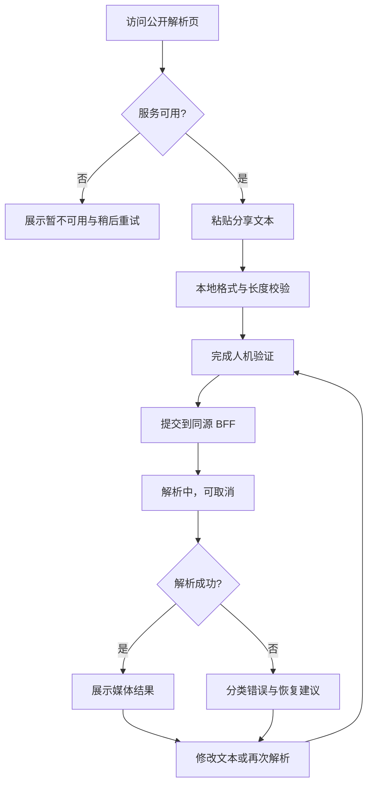
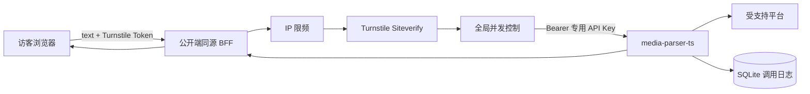

# Media Parser 匿名公开前端设计方案

> 文档状态：设计提案  
> 适用服务：`media-parser-ts` 0.1.x  
> 基线日期：2026-08-30（Asia/Shanghai）  
> 交付边界：本文只描述公开页面、匿名访问安全架构与接口建议，不代表已经创建前端、BFF 或修改核心 API。

> **当前实现覆盖说明（2026-08-30）**：按最新产品要求，已实现的公开页不使用 Turnstile，浏览器接口只提交 `text`。本文涉及 Turnstile 的内容保留为原始设计提案，不属于当前实现；当前匿名防滥用边界为服务端专用 API Key、可信访客 IP 限频和独立全局并发限制。

## 1. 结论

公开端是一页式匿名媒体解析工作台。访客粘贴分享文本，通过人机验证后提交；页面以业务化方式展示视频、音频、图集、实况和字幕，同时提供必要的技术详情与错误反馈。

核心 `/api/parse` 强制 API Key，因此公开网页不能直接调用核心 API，也不能在 JavaScript、构建产物、页面配置或浏览器存储中内置共享 Key。建议架构是在公开端同源部署轻量 BFF：浏览器只提交分享文本和 Turnstile Token，BFF 完成服务端人机验证、匿名限流与并发控制，再用服务端保存的专用 API Key 调用核心服务。

视觉沿用“暖白 + 墨绿 + 橙色”品牌体系，但比后台更轻、更宽松、更强调任务引导。桌面端为请求/结果双栏，平板和手机端顺序堆叠，不提供账号、历史记录、收藏、媒体代理下载或解析结果云端管理。

## 2. 产品定位

### 2.1 目标访客

- 临时需要从支持平台分享文本中提取媒体资源的普通访客。
- 需要快速确认分享链接能否被当前服务识别的内容运营人员。
- 不掌握 API Key、不需要理解 JSON 契约的非技术用户。

### 2.2 核心任务

1. 了解服务用途、支持范围和隐私边界。
2. 粘贴完整分享文案或链接。
3. 完成人机验证并发起解析。
4. 在等待期间理解当前状态并可取消请求。
5. 预览或打开解析出的媒体资源。
6. 在失败时知道是输入、验证码、限流、平台、上游还是服务问题。

### 2.3 成功标准

- 首次访问者无需阅读文档即可完成一次解析。
- 浏览器端任何位置都不存在核心 API Key 或 Turnstile Secret。
- 分享文本最多 2000 字符，与核心 API 契约一致。
- 视频、音频、图集、实况和字幕都有清晰且可降级的展示方式。
- 所有错误提供下一步建议；技术错误包含可复制 Request ID（若响应提供）。
- 1440px、1024px、768px、390px 均无页面级横向溢出。
- 页面明确告知输入、结果、IP 和 User-Agent 的 30 天留存策略。

### 2.4 非目标

- 不提供账号注册、登录、个人中心、历史记录、收藏或同步。
- 不在浏览器中要求访客输入 API Key。
- 不代理下载、转码、合并或永久保存媒体文件。
- 不承诺所有平台媒体 URL 都能被浏览器跨域预览。
- 不绕过登录、验证码、平台授权或内容访问限制。
- 不向公开访客暴露平台 Cookie 配置、内部错误堆栈或服务端日志。

## 3. 体验原则

1. **单任务优先**：首屏直接完成“粘贴—验证—解析”，不以营销内容挤占工作区。
2. **完整分享文本优先**：说明可以粘贴整段文案，避免要求用户手工提取 URL。
3. **等待可理解**：短链跳转和上游访问可能耗时，展示具体等待文案并允许取消。
4. **结果先业务化**：先展示标题、作者和媒体，再将完整 JSON 放进折叠技术详情。
5. **失败可恢复**：错误文案说明下一步，验证码失效或使用后自动生成新验证。
6. **公开不等于无边界**：匿名访问仍需验证码、IP 限流、全局并发和上游专用 Key 限制。
7. **隐私提前说明**：留存说明位于提交按钮附近，不藏在页脚长条款中。

## 4. 访客流程



提交成功、失败或取消后都将当前 Turnstile Token 视为已消费，下一次提交必须取得新 Token。

## 5. 页面结构

页面只有一个公开路由 `/`，通过锚点访问支持平台和隐私说明，不拆分多页面门户。

```text
页面
├── 顶栏
│   ├── 品牌
│   ├── 服务状态
│   └── 支持平台入口
├── 首屏说明
├── 解析工作区
│   ├── 请求面板
│   │   ├── 分享文本
│   │   ├── 字数与输入提示
│   │   ├── Turnstile
│   │   ├── 隐私摘要
│   │   └── 解析/取消操作
│   └── 结果面板
│       ├── 空状态
│       ├── 等待状态
│       ├── 错误状态
│       └── 成功结果
├── 支持平台
├── 使用与隐私提示
└── 页脚
```

## 6. 区域设计

### 6.1 顶栏

#### 左侧品牌

- 品牌标识：“MP”字母图形。
- 名称：“Media Parser”。
- 副标题：“匿名媒体解析工具”。

#### 右侧状态

| 状态 | 文案 | 颜色 |
| --- | --- | --- |
| 检查中 | 正在检查服务 | 中性灰 |
| 可用 | 服务已就绪 | 绿色 |
| 部分异常 | 服务暂未就绪 | 琥珀色 |
| 不可达 | 无法连接服务 | 红色 |

提供“重新检查”文本按钮。状态只表达公开可用性，不展示数据库、密钥或 Parser 内部细节。

“支持平台”入口滚动到平台区域，并显示当前可用数量；在缺少公共平台目录接口时只显示“查看支持平台”，不伪造实时数量。

### 6.2 首屏说明

#### 推荐文案

主标题：

> 粘贴分享文本，提取可用媒体资源

说明：

> 支持多个常见视频、图文与音频平台。请粘贴完整分享文案或链接，我们会自动识别平台并返回可用资源。

使用三个短标签说明核心价值：

- 自动识别分享链接
- 视频、图集、音频与字幕
- 无需注册账号

不要使用“永久有效”“无水印保证”“100% 成功”等无法由服务契约保证的宣传文案。

### 6.3 请求面板

#### 分享文本

- 使用 6–8 行文本域，最大 2000 字符。
- Placeholder：“粘贴 App 中复制的完整分享文案，或输入支持平台的链接”。
- 输入右下角实时显示 `当前字数 / 2000`。
- 自动去除提交值首尾空白，但不在用户输入时改写内容。
- 不将分享文本写入 URL、LocalStorage 或 SessionStorage。

#### 本地校验

| 情况 | 反馈 |
| --- | --- |
| 全空白 | “请输入分享文本或链接” |
| 超过 2000 字符 | 阻止继续输入并说明限制 |
| 未完成人机验证 | “请先完成人机验证” |
| 正在解析 | 禁止重复提交，显示取消按钮 |

前端不自行判断平台或 URL 合法性；最终识别和安全校验由核心服务完成。

#### Turnstile

- 使用显式渲染，适配 SPA 生命周期。
- Widget 紧邻提交操作，不放在首屏不可见区域。
- 验证进行中时解析按钮不可提交。
- Token 过期、失败、解析提交完成或取消后重置 Widget。
- 页面只接收公开 Site Key；Secret Key 只允许存在于 BFF。

Cloudflare 要求服务端通过 Siteverify 验证 Token；Token 有效期为五分钟且只能验证一次。实现时应以 [Cloudflare Turnstile 服务端校验文档](https://developers.cloudflare.com/turnstile/get-started/server-side-validation/) 为准。

#### 提交区

- 主按钮：“开始解析”，前置箭头或解析图标。
- 解析中主按钮变为“正在解析”，同时出现“取消请求”次按钮。
- 支持 `Ctrl/Command + Enter` 提交，但只在输入合法且验证完成时触发。
- 按钮下方显示简短隐私说明和“了解数据使用”锚点。

### 6.4 结果面板

结果面板在请求前保持稳定高度，避免提交后页面剧烈跳动。

#### 空状态

- 简单抽象媒体图形，使用 CSS/图标，不依赖外部图片。
- 标题：“解析结果将在这里展开”。
- 说明：“成功后可预览视频、音频、封面、图集与字幕。”

#### 等待状态

- Spinner 或三段脉冲图形。
- 标题：“正在识别并请求上游平台”。
- 说明：“部分短链需要多次跳转，通常需要几秒到几十秒。”
- 持续时间超过 10 秒后补充：“仍在处理中，你可以继续等待或取消请求。”
- 不显示虚构百分比进度。

#### 成功摘要

- 平台 Badge。
- 媒体标题；缺失时显示“未提供标题”。
- 作者头像、昵称；缺失时整个作者行隐藏。
- 封面图；加载失败时使用中性色占位，不影响其他媒体展示。
- 请求耗时与 HTTP 状态放在结果面板右上角的技术型小标签中。

### 6.5 支持平台区域

采用响应式平台网格：桌面 4–6 列，平板 3 列，手机 2 列。每项展示平台名、媒体类型和可用/维护状态。

平台目录必须来自建议的公共接口或与核心版本绑定的明确静态快照。静态快照需要标注更新时间，不能将后台启停状态伪装为实时状态。

### 6.6 使用与隐私提示

使用简短、直接的说明卡：

- 只提交你有权访问和处理的内容。
- 平台可能限制跨域播放、临时 URL、Referer 或登录状态。
- 页面预览失败不等于解析失败，可尝试打开资源链接。
- 服务不会替你绕过平台授权、验证码或隐私限制。
- 分享文本、解析结果、IP 和 User-Agent 默认保留 30 天，用于提供服务和排查故障。

### 6.7 页脚

只保留品牌、服务说明、隐私锚点和“支持平台会随上游变化”的提示。不展示后台入口，避免公开暴露管理端位置。

## 7. 媒体结果展示规则

### 7.1 视频

- 合并 `video_url` 与 `video_list`，按原顺序去重。
- 第一条作为主播放器，使用 `controls` 和 `preload="metadata"`。
- 有封面时作为 Poster。
- 多视频使用序号切换器和资源链接列表，不同时加载所有视频内容。
- 播放失败时展示“浏览器无法直接预览”，仍保留安全外链。

### 7.2 音频

- 使用原生音频播放器与资源链接。
- 不自动播放，不在页面加载时预取完整音频。
- 若视频和音频同时存在，音频放在视频之后的独立区块。

### 7.3 图片与实况

- 图片使用自适应网格与懒加载。
- 点击进入轻量预览；原图外链单独提供。
- 对 `{url, live_photo_url}` 类型同时展示静态图与“打开实况视频”。
- 图片为空但存在 `live_photo_url` 时仍保留实况入口。
- 加载失败的单张图片不影响整组图集。

### 7.4 字幕

- 默认展示前若干条并提供展开全部。
- 有 `start_ms/end_ms` 时格式化为时间范围；无时间时只显示文本。
- 字幕按服务端顺序展示，不自行排序或合并。

### 7.5 技术详情

- 成功或失败响应均可展开“技术详情”。
- 使用格式化纯文本 JSON，不渲染 HTML。
- 提供显式复制按钮和复制结果反馈。
- 手机端代码块在自身容器横向滚动，不撑开页面。

### 7.6 URL 安全

- 所有媒体地址在写入 `src` 或 `href` 前解析为 URL。
- 只允许 `http:` 和 `https:`。
- 外链使用新窗口并设置 `noopener noreferrer`。
- 无效或其他协议仅作为不可点击文本显示，不能进入 DOM URL 属性。

## 8. 状态与错误设计

### 8.1 状态矩阵

| 状态 | 结果区 | 表单行为 | Turnstile |
| --- | --- | --- | --- |
| 初始 | 空状态 | 可编辑 | 等待验证 |
| 验证中 | 空状态 | 可编辑，不能提交 | 处理中 |
| 解析中 | 等待状态 | 文本只读，可取消 | Token 已提交 |
| 成功 | 媒体结果 | 可修改并再次提交 | 重置 |
| 业务失败 | 错误卡 + 技术详情 | 保留输入 | 重置 |
| 网络失败 | 网络错误卡 | 保留输入，可重试 | 重置 |
| 用户取消 | “请求已取消” | 保留输入 | 重置 |

### 8.2 错误文案

| HTTP/错误 | 标题 | 恢复建议 |
| --- | --- | --- |
| 输入校验失败 | 分享文本不符合要求 | 检查是否为空或超过 2000 字符 |
| Turnstile 无效/过期 | 人机验证已失效 | 完成新的验证后重试 |
| `401`（只应发生在 BFF 到核心） | 服务授权配置异常 | 对访客显示“服务暂不可用”，不要提示 API Key |
| `429` | 请求过于频繁 | 展示 `Retry-After` 或可重试时间 |
| `UNSUPPORTED_PLATFORM` | 暂不支持这个平台 | 检查链接来源，查看支持平台 |
| 平台已停用 | 平台正在维护 | 稍后再试或选择其他平台 |
| 上游超时/失败 | 上游平台暂时没有响应 | 稍后重试，不进行无间隔自动重试 |
| `503` | 服务暂未就绪 | 稍后重试并保留输入 |
| 媒体预览失败 | 浏览器无法直接预览 | 使用资源外链检查解析结果 |
| 未知错误 | 暂时无法完成解析 | 展示 Request ID 并提供重试 |

公开错误不能出现核心 API 地址、完整上游响应头、Cookie、API Key、堆栈、数据库路径或内部网络信息。

## 9. 线框图

### 9.1 桌面端：初始状态

```text
┌────────────────────────────────────────────────────────────────────────────┐
│ [MP] Media Parser · 匿名媒体解析工具       ● 服务已就绪   支持平台 ↓       │
├────────────────────────────────────────────────────────────────────────────┤
│                                                                            │
│  粘贴分享文本，提取可用媒体资源                                             │
│  支持常见视频、图文与音频平台，无需注册账号。                               │
│                                                                            │
│ ┌─────────────────────────────┬──────────────────────────────────────────┐ │
│ │ 01 / 输入分享内容           │ 02 / 解析结果                            │ │
│ │                             │                                          │ │
│ │ 分享文本或链接              │             ·  ·  ·                     │ │
│ │ ┌─────────────────────────┐ │       结果将在这里展开                  │ │
│ │ │                         │ │                                          │ │
│ │ │                         │ │ 成功后可预览视频、音频、图集与字幕。     │ │
│ │ └─────────────────────────┘ │                                          │ │
│ │ 完整分享文案更容易识别 0/2000│                                          │ │
│ │ [       Turnstile        ] │                                          │ │
│ │ 提交内容与结果默认保留30天  │                                          │ │
│ │ [ → 开始解析 ]             │                                          │ │
│ └─────────────────────────────┴──────────────────────────────────────────┘ │
│                                                                            │
│  支持平台                                                                  │
│  [抖音·视频/图集] [小红书·视频/图集] [哔哩哔哩·视频/音频] ...             │
└────────────────────────────────────────────────────────────────────────────┘
```

### 9.2 桌面端：成功结果

```text
┌─────────────────────────────┬──────────────────────────────────────────┐
│ 分享文本                    │ HTTP 200 · 1.8s                           │
│ ┌─────────────────────────┐ │ [抖音]                                   │
│ │ 原输入...               │ │ 媒体标题                                 │
│ └─────────────────────────┘ │ 头像  作者昵称                            │
│                             │                                          │
│ [新的 Turnstile]           │ ┌──────────────────────────────────────┐ │
│ [ → 再次解析 ]             │ │               视频                   │ │
│                             │ └──────────────────────────────────────┘ │
│                             │ 视频资源 1 · 打开链接                    │
│                             │ 图片 / 音频 / 字幕区块                   │
│                             │ ▸ 技术详情                               │
└─────────────────────────────┴──────────────────────────────────────────┘
```

### 9.3 平板端

```text
┌──────────────────────────────────────────────────────┐
│ [MP] Media Parser              ● 就绪   支持平台 ↓   │
├──────────────────────────────────────────────────────┤
│ 粘贴分享文本，提取可用媒体资源                       │
│ ┌──────────────────────┬───────────────────────────┐ │
│ │ 输入与验证           │ 结果                      │ │
│ │                      │                           │ │
│ └──────────────────────┴───────────────────────────┘ │
│ 支持平台（3 列）                                     │
└──────────────────────────────────────────────────────┘
```

在窄平板上双栏比例可调整为 42%/58%；低于 768px 后改为单列。

### 9.4 手机端

```text
┌──────────────────────────────┐
│ [MP] Media Parser    ● 就绪  │
├──────────────────────────────┤
│ 粘贴分享文本，               │
│ 提取可用媒体资源             │
│                              │
│ ┌──────────────────────────┐ │
│ │ 01 输入分享内容          │ │
│ │ [文本域                ] │ │
│ │ 0 / 2000                │ │
│ │ [Turnstile]             │ │
│ │ 数据默认保留 30 天      │ │
│ │ [      开始解析      ]  │ │
│ └──────────────────────────┘ │
│                              │
│ ┌──────────────────────────┐ │
│ │ 02 解析结果             │ │
│ │ 视频 / 图集 / 字幕      │ │
│ │ ▸ 技术详情              │ │
│ └──────────────────────────┘ │
│                              │
│ 支持平台（2 列）             │
└──────────────────────────────┘
```

## 10. 视觉规范

### 10.1 品牌 Token

公开端与后台使用同一基础 Token，公开端增加更宽松的留白和更轻的表面层级。

| Token | 值 | 用途 |
| --- | --- | --- |
| `colorInk` | `#18211D` | 主文字、品牌标识 |
| `colorInkSoft` | `#35423B` | 次级深文字 |
| `colorCanvas` | `#F2F4EE` | 页面背景 |
| `colorCanvasTop` | `#F9F9F4` | 顶部渐变起点 |
| `colorSurface` | `#FFFFFF` | 结果面板 |
| `colorSurfaceWarm` | `#F7F8F4` | 请求面板 |
| `colorPrimary` | `#E85D35` | 主按钮、焦点和品牌强调 |
| `colorPrimaryHover` | `#C94825` | 主操作悬停 |
| `colorSuccess` | `#167A59` | 服务正常、解析成功 |
| `colorWarning` | `#B86A12` | 未就绪、限流 |
| `colorError` | `#B83A3A` | 失败、不可用 |
| `colorBorder` | `#D9DED7` | 面板和输入边框 |
| `colorTextSecondary` | `#68736D` | 说明文字 |

背景可使用非常轻的橙色径向渐变，但不能影响文字对比度。品牌橙只用于主操作和小面积强调，不作为长文本背景。

### 10.2 排版与尺寸

| 项目 | 规范 |
| --- | --- |
| 字体 | `Inter`, `ui-sans-serif`, 系统无衬线字体 |
| 等宽字体 | `SFMono-Regular`, `Menlo`, `Consolas`, monospace |
| Hero 标题 | `clamp(34px, 5vw, 58px)`，行高 1.05 |
| 面板标题 | 21px / 29px，600–700 |
| 正文 | 15px / 25px |
| 表单标签 | 13px / 20px，600 |
| 辅助文字 | 12px / 18px |
| 页面最大宽度 | 1480px |
| 桌面页边距 | 34px |
| 手机页边距 | 16px |
| 工作区圆角 | 22px |
| 输入圆角 | 12px |
| 主按钮高度 | 48px |
| 工作区阴影 | `0 22px 55px rgb(43 55 48 / 9%)` |

### 10.3 动效

- 按钮和输入只使用 120–180ms 颜色、阴影或轻位移动效。
- 等待动画应平缓，不使用大面积旋转或闪烁。
- 新结果进入时只淡入内容，不滚动劫持用户位置。
- `prefers-reduced-motion` 下取消位移、脉冲和自动滚动。

## 11. 支持平台快照

当前核心定义包含以下 31 个平台。此表用于设计内容基线，不代表所有平台在任意时间都能匿名成功解析；实际可用性受平台启停、授权状态和上游变化影响。

| 平台 | ID | 媒体能力 |
| --- | --- | --- |
| AcFun | `acfun` | 视频 |
| Soul | `soul` | 视频、图片 |
| 全民K歌 | `quanminkge` | 视频 |
| 剪映 | `jianying` | 视频、图片、音频 |
| 即梦AI | `jimeng` | 视频 |
| 小云雀AI | `xiaoyunque` | 视频、图片 |
| 可灵AI | `kling` | 视频 |
| 哔哩哔哩 | `bilibili` | 视频、音频 |
| 好看视频 | `haokan` | 视频 |
| 小红书 | `xiaohongshu` | 视频、图片、实况 |
| 视频号 | `wechat_channels` | 视频 |
| 微博 | `weibo` | 视频、图片 |
| 微视 | `weishi` | 视频 |
| 快手 | `kuaishou` | 视频、图片、音频 |
| 抖音 | `douyin` | 视频、图片、音频、实况 |
| 新片场 | `xinpianchang` | 视频 |
| 最右 | `zuiyou` | 视频、图片 |
| 梨视频 | `lishipin` | 视频 |
| 汽水音乐 | `qsmusic` | 视频、音频、字幕 |
| 皮皮搞笑 | `pipigaoxiao` | 视频 |
| 皮皮虾 | `pipixia` | 视频、图片 |
| 知乎 | `zhihu` | 视频、图片 |
| 绿洲 | `lvzhou` | 视频、图片 |
| 美拍 | `meipai` | 视频 |
| 腾讯频道 | `tencent_channel` | 视频 |
| 虎牙 | `huya` | 视频 |
| 西瓜视频 | `xigua` | 视频 |
| 豆包 | `doubao` | 视频、图片 |
| 通义千问 | `qianwen` | 视频、图片 |
| 夸克AI | `quark_ai` | 视频、图片 |
| 闲鱼 | `xianyu` | 图片 |

公开列表不展示哪些平台配置了 Cookie，也不暗示未配置凭据的平台可以绕过登录要求。

## 12. 匿名 BFF 概念方案

### 12.1 架构



### 12.2 浏览器接口建议

#### `GET /web-api/status`

只返回公开状态：

```json
{
  "status": "ok",
  "ready": true,
  "checked_at": "2026-08-30T12:00:00.000Z"
}
```

#### `GET /web-api/platforms`

代理核心建议平台目录，只返回公开字段。

#### `POST /web-api/parse`

请求：

```json
{
  "text": "分享文本或链接",
  "turnstile_token": "浏览器取得的一次性 Token"
}
```

BFF 响应保留核心解析成功/失败契约，并可附加公开 Request ID。BFF 不把核心 API Key、Turnstile Secret、上游 Cookie 或内部地址返回浏览器。

### 12.3 请求顺序

1. 验证 JSON Content-Type、字段白名单、文本长度与非空白。
2. 按可信访客 IP 执行前置限频，避免无效验证码请求轰击 Siteverify。
3. 调用 Turnstile Siteverify，校验 `success`、预期 action、预期 hostname 和可选 remote IP。
4. 获取全局并发槽；无槽时返回带 `Retry-After` 的 `429`。
5. 使用服务端专用 API Key 调用核心 `POST /api/parse`。
6. 透传浏览器取消信号，完成后幂等释放并发槽。
7. 返回经过允许头过滤后的 JSON；不代理任意目标 URL。

建议默认值：

| 设置 | 建议值 | 说明 |
| --- | --- | --- |
| 每 IP 限频 | 6 次/分钟 | 无效验证码也计数 |
| 全局匿名并发 | 8 | 独立于核心全局并发 |
| Turnstile 超时 | 5 秒 | 超时关闭请求，不跳过验证 |
| 核心请求超时 | 略高于核心解析超时 | 为响应传输保留少量余量 |
| 文本长度 | 1–2000 字符 | 与核心一致 |
| Token 长度 | 不超过 Turnstile 官方上限 | 先做请求体限制 |

这些数值是部署建议，不属于现有服务配置。

### 12.4 API Key 边界

- 为公开 BFF 创建单独调用方和专用 API Key。
- Key 仅通过服务端环境或密钥管理设施注入。
- Key 不得出现在 `VITE_*`、HTML、前端运行时配置、Source Map、浏览器响应或分析事件中。
- 公开 BFF 的 Key 应在核心后台配置独立每分钟限频和最大并发。
- 轮换时先注入新 Key 并验证，再吊销旧 Key；页面无需感知完整值。
- 浏览器收到核心 `401` 时只显示服务配置异常，不能提示访客输入或检查 API Key。

### 12.5 Turnstile 边界

- Site Key 可以公开，Secret Key 只能存在 BFF。
- 每次解析必须服务端校验，不能只相信前端回调。
- 校验失败、超时或重复 Token 均拒绝请求。
- 生产必须配置真实 Key；开发与测试使用官方测试 Key，不设计可误用于生产的绕过开关。
- CSP 仅为 Turnstile 官方脚本与 Frame 增加必要来源，不放宽其他脚本来源。

### 12.6 代理与日志

- BFF 只转发固定核心地址和固定接口，禁止接受用户提供的目标 URL。
- 只有在部署网络可信时转发访客 IP；核心 `TRUST_PROXY` 必须与真实代理层级一致。
- User-Agent 可以转发，但按不可信文本处理。
- BFF 运行日志只记录 Request ID、状态、耗时和错误分类，不记录完整文本、Token、Key 或响应正文。
- 核心服务仍按当前策略记录已鉴权调用的输入、结果、IP 和 User-Agent。

## 13. 当前核心接口契约

### 13.1 请求

核心接口：

```http
POST /api/parse
Authorization: Bearer mp_<key-id>_<secret>
Content-Type: application/json
```

```json
{
  "text": "分享文本或链接"
}
```

`text` 必填，1–2000 字符且不能全为空白。Authorization 只应由 BFF 添加，浏览器不接触该头。

### 13.2 成功响应

```json
{
  "retcode": 200,
  "retdesc": "成功",
  "data": {
    "video_id": "...",
    "platform": "抖音",
    "title": "...",
    "video_url": "https://...",
    "audio_url": "https://...",
    "cover_url": "https://...",
    "author": {
      "nickname": "...",
      "author_id": "...",
      "avatar": "https://..."
    },
    "image_list": [],
    "video_list": [],
    "subtitles": []
  },
  "succ": true
}
```

说明：

- `video_url`、`audio_url`、`cover_url`、`author` 可以为 `null`。
- `video_list` 只有存在多个视频时才可能出现。
- `subtitles` 只有存在字幕时才可能出现。
- `image_list` 项可以是 URL 字符串，也可以是 `{url, live_photo_url}`。
- 页面应按字段存在性渲染，不能假设成功响应一定包含视频。

### 13.3 失败响应

```json
{
  "retcode": 400,
  "retdesc": "错误说明",
  "data": null,
  "succ": false,
  "error_code": "ERROR_CODE"
}
```

界面使用 `error_code` 决定恢复建议，使用 `retdesc` 作为用户可读描述；未知错误码进入通用错误态。

## 14. 建议公共平台目录接口

当前只有管理员平台列表。为了让公开页面展示实时启停状态，建议增加只读、无鉴权接口：

```http
GET /api/platforms
```

建议响应：

```json
{
  "data": {
    "items": [
      {
        "id": "douyin",
        "name": "抖音",
        "enabled": true,
        "media_types": ["video", "images", "audio", "live_media"],
        "domains": ["douyin.com", "v.douyin.com"]
      }
    ]
  },
  "request_id": "..."
}
```

接口只返回平台定义和启停状态，不返回凭据名称、是否配置、掩码、来源、测试样例或最近测试错误。公开 BFF 可缓存最多 60 秒，但维护状态变化后应在合理时间内更新。

该接口仅为文档建议，本文不修改 OpenAPI 或服务端代码。

## 15. 隐私设计

### 15.1 提交区短文案

> 为完成解析和排查故障，服务会记录你提交的分享文本、解析结果、IP 与 User-Agent，默认保存 30 天。请勿提交包含隐私或未获授权的内容。

“了解数据使用”跳转到页面下方完整说明。

### 15.2 完整说明

建议覆盖：

1. 收集内容：分享文本、提取 URL、解析结果、请求 IP、User-Agent、Request ID、状态和耗时。
2. 使用目的：提供解析结果、限流、防滥用、故障排查和服务统计。
3. 留存时间：默认 30 天，到期按服务清理策略删除。
4. 第三方访问：解析过程会访问分享链接对应平台；Turnstile 会参与人机验证。
5. 用户责任：只能提交有权访问与处理的内容，不提交账号密码、Cookie、Token 或其他秘密。
6. 能力边界：页面不保存本地历史，但服务端留存策略不因此改变。

### 15.3 日志与分析

- 不接入会采集分享文本或媒体 URL 的前端分析事件。
- 错误监控如需启用，只上传错误分类、页面版本和公开 Request ID。
- 禁止录制文本域、结果 JSON、媒体 URL 和 Turnstile Token。

## 16. 响应式、可访问性与性能

### 16.1 响应式

| 宽度 | 布局 |
| --- | --- |
| `>= 1200px` | 工作区约 42%/58% 双栏，平台 5–6 列 |
| `768–1199px` | 双栏压缩或在窄平板切换单栏，平台 3 列 |
| `< 768px` | 请求在前、结果在后，平台 2 列 |
| `< 480px` | 16px 页边距，按钮满宽，媒体列表单列 |

- 每个 Grid 子项和媒体容器设置 `min-width: 0`。
- 长 URL 和 JSON 在自身容器换行或滚动。
- 视频宽度不超过容器，保持合理宽高比。
- Turnstile 容器预留高度，减少加载后的布局移动。

### 16.2 可访问性

- 文本域有可见 Label、帮助文本、字数提示和关联错误信息。
- 服务状态和请求结果使用适度的 `aria-live`，避免重复播报每次细微变化。
- 视频、音频使用浏览器原生可访问控件。
- 图片有基于序号的替代文本；纯装饰图形使用 `aria-hidden`。
- 焦点环使用品牌橙的高透明外框，与背景保持对比。
- 错误卡使用 `role="alert"`，成功结果不抢夺焦点。
- 取消、复制、展开和外链都可通过键盘完成。
- 状态不能只通过红绿颜色表达。
- Turnstile 失败时提供可读提示和重新验证入口。

### 16.3 性能

- 首屏不加载任何媒体资源。
- 图片使用懒加载；视频和音频使用 `preload="metadata"`。
- 多视频只初始化当前播放器。
- 技术详情关闭时不执行昂贵的高亮或 DOM 渲染。
- 平台目录可短时间缓存；解析请求不得缓存。
- 页面取消请求时向 BFF 传播 AbortSignal，避免无用占用并发。

## 17. 推荐文案

| 场景 | 文案 |
| --- | --- |
| 输入帮助 | “可直接粘贴 App 中复制的完整分享文案。” |
| 隐私摘要 | “提交内容、结果、IP 与 User-Agent 默认保留 30 天。” |
| 等待 | “正在识别并请求上游平台，部分短链需要多次跳转。” |
| 长等待 | “仍在处理中，你可以继续等待或取消请求。” |
| 取消 | “请求已取消，你可以修改分享文本后重新发起。” |
| 限流 | “请求过于频繁，请在 {seconds} 秒后重试。” |
| 预览失败 | “解析已经成功，但浏览器无法直接预览此资源。” |
| 维护 | “该平台正在维护，请稍后再试。” |
| 未支持 | “暂不支持这个平台，请检查链接来源或查看支持列表。” |
| 验证过期 | “人机验证已过期，请重新完成验证。” |

## 18. 验收清单

### 任务流程

- [ ] 首屏可完成输入、验证和提交，不需要登录或输入 API Key。
- [ ] 输入限制与核心 API 的 1–2000 非空白字符一致。
- [ ] 解析中可取消，完成后必须重置 Turnstile。
- [ ] 视频、音频、图片、实况和字幕均有明确展示与降级。
- [ ] 成功和失败响应都可主动展开技术详情。

### 安全与隐私

- [ ] 核心 API Key 不存在于 HTML、JavaScript、Source Map、浏览器存储、响应或日志。
- [ ] Turnstile Secret 只存在 BFF，所有解析请求均进行服务端验证。
- [ ] BFF 只代理固定接口，不接受任意上游地址。
- [ ] 外链只允许 HTTP(S)，JSON 和上游文本不作为 HTML 渲染。
- [ ] 提交按钮附近清晰展示 30 天留存摘要。
- [ ] 前端分析和错误监控不采集分享文本、媒体 URL 或 Token。

### 状态与错误

- [ ] 服务不可达、未就绪、验证码失败、限流、平台不支持、上游失败和预览失败均有独立文案。
- [ ] `401` 不向访客泄露共享 API Key 的存在或格式。
- [ ] 错误不包含堆栈、内部地址、Cookie、Key 或凭据。
- [ ] 有 Request ID 时可以复制，无 Request ID 时不显示空占位。

### 布局与可访问性

- [ ] 1440px、1024px、768px、390px 无页面级横向溢出。
- [ ] 手机端顺序固定为输入、结果、支持平台、隐私说明。
- [ ] 长 URL、JSON 和媒体只在自身容器内滚动或换行。
- [ ] 键盘可完成输入、验证、提交、取消、展开和复制。
- [ ] 焦点、错误、状态和 Reduced Motion 行为符合可访问性要求。

### 文档边界

- [ ] 本文不承诺已创建公开前端、BFF、Turnstile 配置或建议接口。
- [ ] 实现前重新核对核心 API 契约、平台清单、日志留存与 Turnstile 官方要求。
